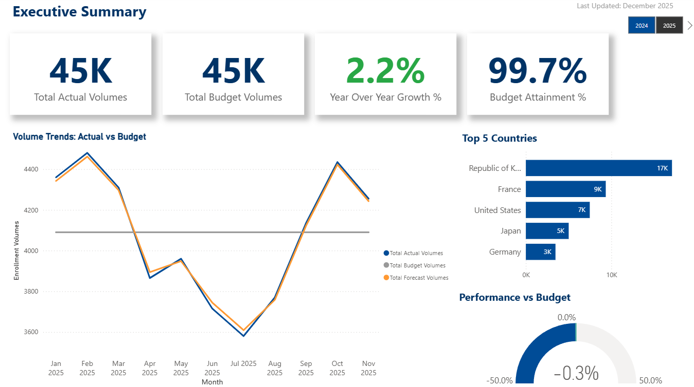
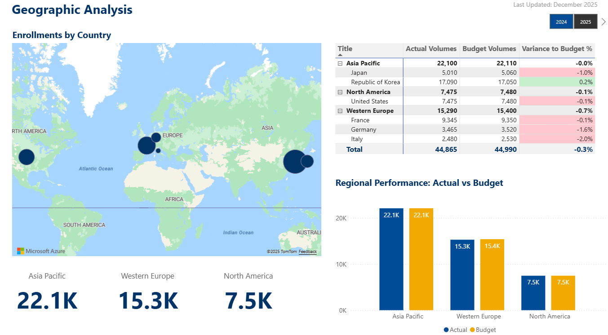
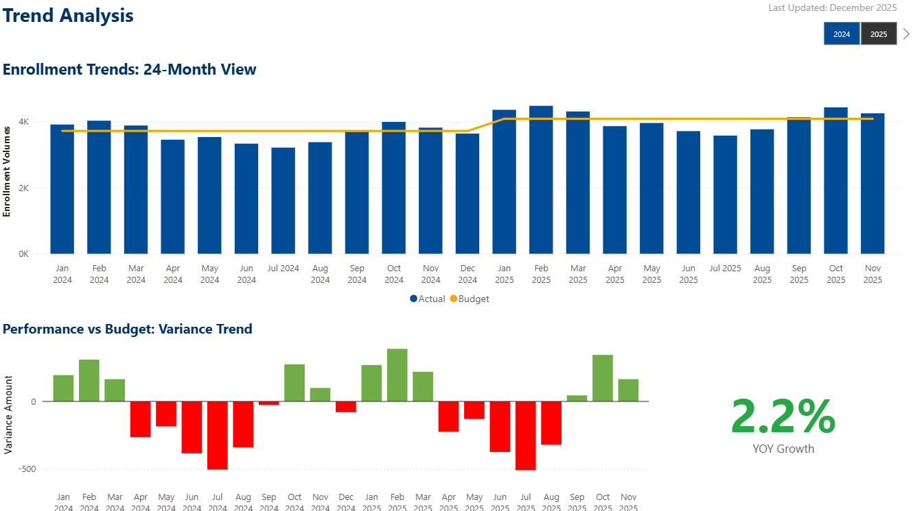
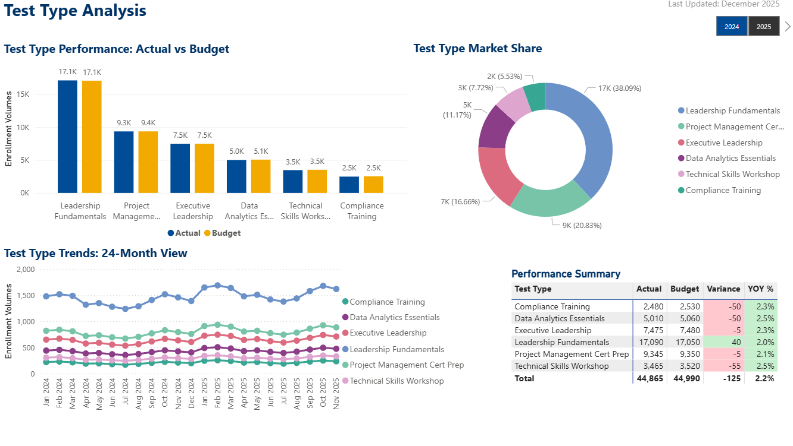

# Global Training Enrollment System

**A comprehensive Power Platform solution for collecting, validating, and reporting training enrollment volumes across a global network of training centers**

[](https://powerapps.microsoft.com/)
[](https://powerapps.microsoft.com/)
[](https://flow.microsoft.com/)
[](https://powerbi.microsoft.com/)
[](https://www.microsoft.com/en-us/microsoft-365/sharepoint/collaboration)

---

## 📋 Project Overview

After 20 years in educational services, I built and maintained an enrollment tracking dashboard that served executive leadership for 8 years. When organizational requirements expanded to include training centers not in our centralized database, we attempted to patch together a solution using email-based Excel submissions and Power BI. The result was fragile—breaking whenever centers changed formats, requiring hours of manual data cleanup, and creating reporting delays.

This portfolio project represents what I wish we'd built: a properly architected Power Platform solution that handles data inconsistency gracefully, eliminates manual processing, and provides real-time visibility to stakeholders.

### Business Problem

Global training organizations with independent or franchised training centers face critical data collection challenges:

- **Fragmented Submission Process**: Centers email Excel files in inconsistent formats, creating version control chaos
- **Manual Data Consolidation**: Finance teams spend 15-20 hours monthly cleaning and consolidating data
- **Data Quality Issues**: Format variations, password-protected files, and missing fields cause errors
- **Delayed Reporting**: Multi-week lag between data submission and executive reporting
- **No Submission Visibility**: No centralized view of which centers have submitted or are overdue
- **Limited Historical Analysis**: Difficult to track trends, identify anomalies, or forecast enrollments
- **Scalability Constraints**: Adding new centers or courses requires manual process changes

### Solution

An integrated Power Platform solution that transforms enrollment data collection from a fragmented, manual process into a standardized, automated workflow:

- **Standardized Data Collection Portal**: Training centers submit volumes through user-friendly forms with built-in validation
- **Intelligent Email Processing**: Automated extraction and parsing of Excel attachments for centers unable to use the portal
- **Data Quality Dashboard**: Systematic validation, anomaly detection, and manual review workflow
- **Real-Time Executive Reporting**: Interactive Power BI dashboards with live data and drill-through capabilities
- **Automated Notifications**: Proactive reminders, anomaly alerts, and completion tracking
- **Audit Trail**: Complete history of all submissions, validations, and corrections

---

## 🎯 Key Features

### Enrollment Submission Portal (Canvas App - External)
- **Training Center Login**: Secure access for authorized center administrators
- **Dynamic Submission Forms**: Conditional logic displays relevant fields based on course type and delivery method
- **Built-in Validation**: Real-time checks prevent incomplete or invalid submissions
- **Mobile-Responsive Design**: Accessible from any device globally
- **Draft Capability**: Save partial submissions and complete later
- **Submission History**: View past submissions and confirmation receipts
- **Multi-Language Support**: Interface available in multiple languages for global accessibility

### Email Processing Automation (Power Automate)
- **Shared Mailbox Monitoring**: Continuously scans for enrollment submission emails
- **Attachment Extraction**: Automatically downloads Excel files from emails
- **Password Detection**: Attempts to open password-protected files using common patterns
- **Flexible Schema Detection**: Adapts to minor format variations across submissions
- **Error Logging**: Captures parsing failures with detailed diagnostics
- **Manual Review Queue**: Routes problematic submissions to administrators
- **Acknowledgment Emails**: Confirms receipt and processing status to centers

### Data Quality Dashboard (Canvas App - Internal)
- **Submission Tracking**: Real-time view of all centers and submission status
- **Anomaly Detection**: Flags volumes that deviate significantly from historical patterns
- **Manual Data Entry**: Interface for entering data from phone calls or special cases
- **Validation Workflow**: Approve, reject, or request clarification on submissions
- **Data Correction Tools**: Edit and annotate submissions with audit trail
- **Communication Center**: Send clarification requests directly to training centers
- **Export Functionality**: Download cleaned data for external systems

### Administrator Console (Canvas App - Internal)
- **Center Management**: Maintain training center directory with contact information
- **Course Catalog Administration**: Add, update, or retire course offerings
- **User Access Control**: Manage permissions for center administrators
- **Submission Configuration**: Set deadlines, required fields, and validation rules
- **Report Scheduling**: Configure automated report distribution
- **System Health Monitoring**: View processing statistics and error rates

### Executive Reporting Dashboard (Power BI)
- **Enrollment Overview**: Global enrollment volumes with trend indicators
- **Geographic Analysis**: Interactive map showing enrollments by region and country
- **Course Performance**: Enrollment trends by course track and delivery method
- **Center Comparison**: Performance benchmarking across training centers
- **Capacity Utilization**: Analysis of enrollments vs. center capacity
- **Forecasting**: Predictive analytics for future enrollment trends
- **Data Freshness Indicators**: Clear visibility into last update time
- **Drill-Through Capabilities**: Navigate from summary to transaction-level detail
- **Mobile App**: Power BI mobile for executives on the go

### Automated Workflows (Power Automate)
- **Submission Reminders**: Weekly emails to centers that haven't submitted by deadline
- **Escalation Notifications**: Alert regional managers when centers are consistently late
- **Anomaly Alerts**: Immediate notification when volumes deviate from expected ranges
- **Daily Status Digest**: Morning email showing submission completion percentage
- **Data Quality Reports**: Weekly summary of validation issues and resolution status
- **Executive Summary**: Monthly email with key metrics and insights
- **System Error Alerts**: Notify administrators of processing failures requiring attention

---

## 🏗️ Technical Architecture

### Data Layer (SharePoint)
**Lists and Libraries:**
- **Training Centers**: Master directory with location, contact, timezone, capacity
- **Course Catalog**: Available courses with track, duration, delivery methods
- **Enrollment Submissions**: Volume records with metadata and status tracking
- **Submission History**: Complete audit trail of all submissions and changes
- **Data Quality Flags**: Anomalies, validation issues, and resolution notes
- **Supporting Documents**: Excel files and supporting documentation library
- **User Access**: Center administrator permissions and contact information

**Key Design Principles:**
- Normalized data structure to prevent redundancy
- Lookup columns for referential integrity
- Calculated columns for derived metrics
- Version history enabled for audit compliance
- Indexed columns for query performance

### Application Layer (Power Apps)
**Three Canvas Apps:**
1. **Enrollment Submission Portal** (External-facing)
   - Public-facing for training center administrators
   - Responsive design for mobile and tablet access
   - Offline capability for draft submissions
   - Component library for consistent UI

2. **Data Quality Dashboard** (Internal)
   - Admin-only access for data validation
   - Real-time submission monitoring
   - Workflow-driven review process
   - Advanced filtering and search

3. **Administrator Console** (Internal)
   - Executive and admin access
   - System configuration management
   - User administration
   - Reporting tools

**Design Standards:**
- Delegation-friendly formulas for performance at scale
- Component-based architecture for reusability
- WCAG 2.1 accessibility compliance
- Consistent error handling and user feedback
- Loading indicators and optimistic updates

### Integration Layer (Power Automate)
**Flow Categories:**
1. **Event-Driven Flows**
   - Triggered by new submissions
   - Respond to validation flags
   - Send notifications on state changes

2. **Scheduled Flows**
   - Daily reminder checks
   - Weekly reporting jobs
   - Monthly archival processes

3. **Email Processing Flows**
   - Parse incoming emails
   - Extract and process attachments
   - Handle exceptions and errors

4. **Approval Flows**
   - Multi-stage validation routing
   - Escalation logic for overdue reviews
   - Parallel processing for efficiency

**Flow Design Principles:**
- Comprehensive error handling with retry logic
- Logging for debugging and audit
- Performance optimization for high volume
- Modular design for maintainability

### Analytics Layer (Power BI)
**Data Model:**
- DirectQuery connection to SharePoint for real-time data
- Star schema with fact and dimension tables
- Calculated tables for time intelligence
- DAX measures for complex KPIs

**Visualizations:**
- Executive summary page with key metrics
- Geographic heat map with drill-through
- Trend analysis with forecasting
- Comparative analysis across dimensions
- Data quality scorecard

**Security:**
- Row-level security based on user roles
- Regional managers see only their centers
- Executives have global view
- Finance team has full access

### Security Model
**Role-Based Access:**
- **Training Center Administrator**: Submit and view own center's data
- **Regional Manager**: View all centers in assigned region
- **Data Quality Analyst**: Validate and correct all submissions
- **System Administrator**: Full system access and configuration
- **Executive Leadership**: Read-only access to analytics
- **Finance Team**: Full data access and export capabilities

**Security Implementation:**
- Azure AD authentication
- SharePoint permission inheritance
- Power Apps context variables for role-based UI
- Power BI RLS for data filtering
- Audit logging for compliance

---

## 📊 Data Model

### Core Entities

**Training Centers**
- Center ID (Primary Key)
- Center Name
- Country
- Region
- Time Zone
- Contact Name
- Contact Email
- Status (Active/Inactive)
- Capacity
- Courses Offered (Multi-select lookup)

**Course Catalog**
- Course ID (Primary Key)
- Course Name
- Course Track (Leadership, Technical, Certification, Compliance)
- Duration (Days)
- Delivery Methods (In-Person, Virtual, Hybrid, Self-Paced)
- Status (Active/Retired)
- Minimum Enrollment
- Maximum Enrollment

**Enrollment Submissions**
- Submission ID (Primary Key)
- Training Center (Lookup to Training Centers)
- Course (Lookup to Course Catalog)
- Delivery Method
- Submission Month
- Enrollment Volume
- Submission Date/Time
- Submitted By
- Submission Method (Portal/Email)
- Status (Draft/Submitted/Validated/Flagged/Approved)
- Data Quality Score

**Data Quality Flags**
- Flag ID (Primary Key)
- Submission (Lookup to Enrollment Submissions)
- Flag Type (Anomaly/Missing Data/Format Error)
- Description
- Severity (Low/Medium/High)
- Resolution Status
- Assigned To
- Resolution Notes
- Created Date
- Resolved Date

### Relationships
- Training Centers (1) → Enrollment Submissions (Many)
- Course Catalog (1) → Enrollment Submissions (Many)
- Enrollment Submissions (1) → Data Quality Flags (Many)

### Key Metrics (DAX Calculations)
- Total Enrollments (Sum)
- YoY Growth %
- Average Enrollments per Center
- Capacity Utilization %
- Data Quality Score (Weighted average)
- Submission Completion Rate
- Average Days to Submit

*Detailed entity relationship diagrams available in `/docs/03-data-model.md`*

---

## 🚀 Getting Started

### Prerequisites
- Microsoft 365 account with appropriate licenses:
  - Power Apps per user or per app license
  - Power Automate premium connectors
  - Power BI Pro or Premium Per User license
- SharePoint site with creator permissions
- Power BI Desktop installed locally
- Admin access for security configuration

### Installation Steps

*Detailed step-by-step setup instructions will be provided in `/docs/installation-guide.md`*

**High-Level Process:**
1. Create SharePoint site and configure lists
2. Import Power Apps from solution package
3. Configure Power Automate flows with environment-specific connections
4. Publish Power BI dashboard and configure data refresh
5. Assign user roles and permissions
6. Seed initial data (training centers and course catalog)
7. Conduct user acceptance testing

---

## 📊 Power BI Dashboard Progress

### Completed Pages
1. **Executive Summary** ✅
   - 4 KPI cards (Total Enrollments, YoY Growth, Avg/Country, Completion Rate)
   - Monthly trend line chart with year-over-year comparison
   - Top 5 countries bar chart
   - Budget variance gauge
   - Year slicer for filtering
   
2. **Geographic Analysis** ✅
   - Azure Maps visualization with proportional bubbles
   - Hierarchical matrix (Region → Country drill-down)
   - Conditional formatting for variance performance
   - 3 regional KPI cards (Asia Pacific, Western Europe, North America)
   - Regional comparison bar chart (Actual vs Budget)
   - Year slicer integration

### Technical Achievements
- Star schema data model with proper relationships
- 17 DAX measures including time intelligence calculations
- Custom Power Automate CSV import flow (138 records)
- Azure Maps integration (upgraded from deprecated Bing Maps)
- Conditional formatting with background color rules
- Cross-visual filtering and drill-down capabilities
- Professional color schemes (blue/orange contrast)

### Data Foundation
- DateTable with fiscal year support (Oct-Sep)
- Fact table: tbl_VolumeSubmissions (138 records, 3 countries, 5 test types)
- Dimension tables: Countries, Regions, TestTypes
- Time period: 2024-2025 (24 months)

---


## 📸 Screenshots

*Screenshots will be added progressively as development proceeds*
### Power Apps 
### Enrollment Submission Portal (Week 2 - Complete)

**Screen 1: Welcome & User Selection**

*Modern card-based design with user dropdown filtered to active coordinators*

**Screen 2: Submission Form**

*Dynamic test type loading with three-column volume entry (Actual, Budget, Forecast)*


*Conditional estimate reason field with validation*

**Screen 3: Confirmation**

*Success confirmation with complete submission details and next steps*

**SharePoint Integration**


*Successful data writes to tbl_VolumeSubmissions with proper lookup formatting*

### Data Quality Dashboard
- Submission tracking overview
- Anomaly detection interface
- Validation workflow
- Communication tools

### Administrator Console
- Center management
- Course catalog administration
- User access control
- System monitoring

### Power BI Dashboard

**Executive Summary Page**

*Executive scorecard with 4 key KPIs (Total Actual/Budget Volumes, YoY Growth 2.2%, Budget Attainment 99.7%), 11-month trend visualization, Top 5 countries bar chart, and performance vs budget gauge with dynamic year filtering*

**Geographic Analysis**

*Interactive dashboard with Azure Maps showing enrollment distribution by country (proportional bubble sizing), hierarchical matrix with Region → Country drill-down, regional performance cards (Asia Pacific 22.1K, Western Europe 15.3K, North America 7.5K), and Actual vs Budget comparison chart with conditional formatting on variance*

**Trend Analysis**

*24-month performance analysis with combo chart (Actual bars + Budget line), variance trend visualization using green/red conditional formatting to highlight positive/negative performance, YoY Growth KPI card (2.2%), and edit interactions configured to maintain full time series context regardless of year filter selection*

**Test Type Analysis**

*Product portfolio dashboard showing test type performance with side-by-side Actual vs Budget column chart, market share donut chart (Leadership Fundamentals 38.09%, Project Management 20.83%, etc.), 24-month trend lines for all 6 test types, and performance summary matrix with conditional formatting on variance and YoY growth metrics*


### Accessibility Considerations

**WCAG 2.1 Level AA compliance addressed:**
- All interactive controls have descriptive AccessibleLabel properties
- Labels describe both control type and purpose
- Dynamic labels reflect control state (enabled/disabled)
- Screen reader users can navigate the full workflow

**Remaining work (documented for production):**
- Gallery item accessibility (individual row navigation)
- Keyboard shortcuts for common actions
- High contrast theme support
- Focus indicators for keyboard navigation

---

## 📁 Project Structure

```
global-training-enrollment-system/
├── docs/                                    # Project documentation
│   ├── 01-project-overview.md               # Business case and objectives
│   ├── 02-requirements.md                   # Functional and technical requirements
│   ├── 03-data-model.md                     # Entity relationships and schemas
│   ├── 04-user-stories.md                   # Use cases and acceptance criteria
│   └── 05-pain-points-and-lessons-learned.md # Original problem and design decisions
│   └── 06-future-enhancements.md            # Parking lot items for future enhancement
├── power-apps/                              # Canvas app documentation
│   ├── screenshots/                         # UI screenshots & wireframes
│   ├── wireframes/                          # UI wireframes
│   │   ├── wireframes-admin_console.pptx    # Admin Console app
│   │   ├── wireframes-dataquality-portal.pptx # Data Quality Portal app 
│   │   └── wireframes-submission-portal.pptx  # Submission Portal app  
│   └── app-documentation.md                 # Design decisions and formulas
├── power-automate/                          # Flow documentation
│   ├── flow-diagrams/                       # Visual workflow diagrams
│   └── flow-documentation.md                # Flow logic and error handling
├── power-bi/                                # Dashboard documentation
│   ├── screenshots/                         # Dashboard visuals
│   └── dashboard-documentation.md           # Data model and DAX measures
├── sharepoint/                              # Data layer documentation
│   ├── screenshots/                         # UI screenshots & wireframes
│   │   ├── tbl_Countries.png                # Country Listing
│   │   ├── tbl_CountryTestTypes.png         # Junction Table Country to Test types 
│   │   ├── tbl_VolumeSubmissions            # Volume Submission Fact table 
│   │   └── tbl_VolumeSubmissions (2)        # Volume Submission Fact table 
│   └── list-schemas.md                      # List structures and relationships
└── README.md                                # This file
```

---

## 🎓 Learning Objectives

This portfolio project demonstrates proficiency in:

### Power Apps Best Practices
- **Component Architecture**: Reusable UI components across multiple apps
- **Performance Optimization**: Delegation-aware formulas for large datasets
- **User Experience Design**: Intuitive interfaces with contextual help
- **Error Handling Patterns**: Graceful failures with clear user guidance
- **Accessibility Standards**: WCAG 2.1 compliance for inclusive design
- **Mobile Responsiveness**: Adaptive layouts for multiple device types
- **State Management**: Efficient use of context variables and collections

### Power Automate Expertise
- **Complex Workflows**: Multi-stage approval and validation processes
- **Email Processing**: Parsing attachments and extracting structured data
- **Error Handling**: Comprehensive try-catch patterns with logging
- **Performance Tuning**: Parallel processing and optimized actions
- **Integration Patterns**: Connecting multiple data sources seamlessly
- **Monitoring and Debugging**: Proactive error detection and resolution

### Power BI Visualization
- **Data Modeling**: Star schema design with optimized relationships
- **DAX Mastery**: Complex measures for business calculations
- **Interactive Design**: Drill-through, bookmarks, and dynamic filtering
- **Time Intelligence**: Year-over-year, quarter-over-quarter comparisons
- **Performance Optimization**: Query folding and aggregation strategies
- **Row-Level Security**: Dynamic filtering based on user context
- **Mobile Design**: Optimized layouts for Power BI mobile app

### Solution Architecture
- **Requirements Analysis**: Translating business problems into technical solutions
- **Data Modeling**: Normalized schema design for scalability
- **Security Design**: Role-based access control across platforms
- **Integration Strategy**: Seamless data flow between Power Platform services
- **Documentation Standards**: Enterprise-grade technical documentation
- **Scalability Planning**: Designing for growth and increased usage
- **Change Management**: Considering user adoption and training needs

---

## 🛠️ Development Approach

### Phase 1: Planning & Design (Week 1) - ✅ COMPLETE

**Final Status:** Complete documentation framework, data model, SharePoint schema, and wireframes ready for development

#### Documentation & Requirements (Days 1-2)
- ✅ Repository setup with professional structure (docs, power-apps, power-automate, power-bi, sharepoint directories)
- ✅ Pain points analysis documenting 8-year history with original SQL-based system and failed email-based redesign
- ✅ Lessons learned from fragile Excel submission process:
  - Password-protected files requiring manual intervention
  - Format variations breaking Power BI refreshes
  - 3+ hours monthly consolidation time
  - Late submissions forcing repeated manual work
- ✅ Requirements document (REQ-101 through REQ-2208) covering:
  - Functional requirements for 3 Power Apps (submission portal, data quality dashboard, admin console)
  - Non-functional requirements (performance, security, usability)
  - Business rules and validation logic
  - Integration requirements (TM1 export, email notifications, Azure AD)
- ✅ User stories for 6 personas with acceptance criteria:
  - Country coordinators (Ji-Won Kim, Marie Dubois, Yuki Tanaka)
  - Data quality analyst (John Rolzhausen)
  - CFO (Robert Chen)
  - Volume entry analyst (Alice Katt)

#### Data Model Design (Days 3-4)
- ✅ Logical data model: 13 entities with complete ERD diagrams
- ✅ Star schema design: VolumeSubmissions (fact) → Countries, TestTypes, DateTable (dimensions)
- ✅ Normalization to 3NF to eliminate redundancy
- ✅ Audit trail pattern: Submission_History capturing all changes
- ✅ Soft delete pattern: IsDeleted flag instead of physical deletion
- ✅ Temporal data pattern: EffectiveDate/EndDate tracking for historical accuracy
- ✅ SharePoint physical schema specification for 9 lists:
  - Master data: tbl_Regions (5 rows), tbl_Countries (6 rows), tbl_TestTypes (6 rows)
  - Relationships: tbl_CountryTestTypes (junction), tbl_UserCountries (assignments)
  - Transactions: tbl_VolumeSubmissions (core fact table)
  - Supporting: tbl_SubmissionHistory (audit trail), tbl_DataQualityFlags, tbl_SystemConfig

#### SharePoint Implementation (Day 5)
- ✅ **9 SharePoint lists created** with complete column definitions:
  - 100+ total columns across all lists
  - Lookup relationships configured (Countries → Regions, Submissions → Countries/TestTypes)
  - Validation rules applied (format checks, range constraints, required fields)
  - Indexed columns for query performance (Status, SubmissionMonth, IsDeleted)
  - Choice columns for standardized data entry
- ✅ **35 sample records loaded** across all lists for testing:
  - 5 regions with codes (APAC, WE, NA, EE, LATAM)
  - 6 countries with timezone offsets and TM1 mappings
  - 6 test types with categories and effective dates
  - 12 country-test type combinations
  - 5 user assignments with primary/backup flags
  - 7 system configuration settings
- ✅ Text field workaround for Person columns (single-user tenant constraint)
- ✅ Email configuration with dedicated test Gmail accounts (security best practice)

#### Design & Wireframes (Days 6-7)
- ✅ **PowerPoint wireframe deck: 30 slides across 3 apps**
- ✅ Submission Portal (11 screens):
  - Welcome screen with user selection dropdown
  - Country selection and test type loading
  - Volume entry form with Actual/Budget/Forecast fields
  - Draft save and validation workflows
  - Confirmation screen with submission ID
  - Historical submissions view
- ✅ Data Quality Dashboard (conceptual):
  - Real-time submission tracking
  - Anomaly detection interface
  - Validation workflow
  - Manual entry capability
- ✅ Administrator Console (conceptual):
  - User management
  - System configuration
  - Reporting tools
- ✅ Design system documented:
  - Color palette (Primary Blue #004C97, Primary Orange #F2A900)
  - Typography standards (headers, body text, captions)
  - Component library (buttons, cards, forms)
  - Layout grids and spacing rules

#### Technical Architecture Documentation
- ✅ Integration architecture: Power Apps ↔ SharePoint ↔ Power Automate ↔ Power BI
- ✅ Security model: Role-based access control, Azure AD authentication
- ✅ Data flow diagrams: Submission → Validation → Analytics pipeline
- ✅ Error handling strategy: Graceful degradation, user feedback, retry logic
- ✅ Performance considerations: Delegation-friendly formulas, indexed columns, query optimization

#### Achievements & Statistics
- **Documentation pages:** 50+ pages of requirements, data model, user stories, pain points
- **SharePoint lists:** 9 lists, 100+ columns, proper relationships and validation
- **Sample data:** 35 records across all lists for realistic testing
- **Wireframe screens:** 30 slides, 11 detailed screens for submission portal
- **Design system:** Complete color palette, typography, component standards
- **Time invested:** 40 hours over 7 days (5-6 hours daily average)

---

### Phase 2: Data Layer & Core Apps (Week 2) - ✅ COMPLETE

**Final Status:** Functional submission portal with 3 screens, SharePoint CRUD operations, and automated email notifications

#### SharePoint Foundation (Days 1-2)
- ✅ Production SharePoint site created and configured
- ✅ 9 lists built with complete column definitions (100+ total columns)
- ✅ Relationships established:
  - Countries → Regions (lookup with restrict delete)
  - TestTypes → Categories (choice column)
  - VolumeSubmissions → Countries (lookup)
  - VolumeSubmissions → TestTypes (lookup)
  - UserCountries → Countries (lookup for assignments)
- ✅ Validation rules applied:
  - SubmissionMonth format: YYYY-MM (e.g., "2025-11")
  - Volume fields: Integer, >= 0
  - Email fields: Valid email format
  - Status fields: Choice from predefined list
- ✅ Indexed columns configured for performance:
  - VolumeSubmissions: SubmissionMonth, Status, IsDeleted
  - Countries: CountryCode, Status
  - TestTypes: TestTypeCode, Status
- ✅ Sample data loaded (35 records):
  - 6 countries with complete profiles
  - 6 test types with TM1 mappings
  - 12 active country-test type combinations
  - 5 user assignments (coordinators and analysts)

#### Power Apps Development (Days 3-6)

**Enrollment Submission Portal - 3 Screen Application:**

**Screen 1: Welcome & User Selection**
- ✅ Welcome message with application purpose
- ✅ User selection dropdown (simulates multi-user in single-user tenant)
- ✅ 4 user personas available:
  - Ji-Won Kim (Korea coordinator)
  - Yuki Tanaka (Japan coordinator)
  - Marie Dubois (France coordinator)
  - Alice Chen (Data quality analyst)
- ✅ "Continue" button with validation (must select user)
- ✅ Theme colors applied (blue primary, white background)
- ✅ Component-based design (reusable header, buttons)

**Screen 2: Submission Form**
- ✅ Dynamic country loading based on selected user
- ✅ Test type dropdown filtered to country's active offerings (via tbl_CountryTestTypes junction table)
- ✅ Month selector (YYYY-MM format dropdown)
- ✅ Three volume input fields:
  - Actual Volume (integer, >= 0)
  - Budget Volume (integer, >= 0)
  - Forecast Volume (integer, >= 0)
- ✅ Real-time validation with error messages:
  - Required field checks
  - Format validation (numbers only)
  - Range validation (no negative numbers)
  - Duplicate submission check (same country/test/month)
- ✅ Two action buttons:
  - "Submit" - Final submission (Status: Submitted)
  - "Save Draft" - Work in progress (Status: Draft)
- ✅ Form reset after successful submission
- ✅ Loading spinner during submission processing

**Screen 3: Confirmation**
- ✅ Success message with submission ID
- ✅ Summary of submitted data:
  - Country name
  - Test type name
  - Submission month
  - Volume amounts (Actual, Budget, Forecast)
  - Submission timestamp
- ✅ "Submit Another" button (returns to Screen 2)
- ✅ "View History" button (future enhancement placeholder)
- ✅ Confirmation receipt (visual indicator of successful submission)

#### SharePoint Integration & CRUD Operations

**Complex ForAll/Patch Patterns Implemented:**
- ✅ Lookup field creation: Text values → ID references
  - Country name "Republic of Korea" → CountryID lookup to tbl_Countries
  - Test type name "Leadership Fundamentals" → TestTypeID lookup to tbl_TestTypes
- ✅ Multi-field patch with all metadata:
  - Volume fields (Actual, Budget, Forecast)
  - Status field (Draft or Submitted)
  - Timestamps (SubmittedDate, LastModifiedDate)
  - User fields (SubmittedByEmail, SubmittedByName)
  - Audit fields (IsDeleted = No, IsEstimate = No)
- ✅ Error handling with try-catch pattern:
  - Successful submissions show confirmation screen
  - Failures display error message with details
  - Network issues handled gracefully
- ✅ Draft vs Submit logic:
  - Draft: Status = "Draft", no validation email sent
  - Submit: Status = "Submitted", triggers confirmation email

**Data Validation Before Submission:**
- ✅ Duplicate detection: Check for existing submission with same Country/TestType/Month
- ✅ Required field enforcement: All fields must have values
- ✅ Format validation: Volumes must be positive integers
- ✅ Lookup validation: Country and test type must exist in master lists
- ✅ Authorization check: User must be assigned to country (via tbl_UserCountries)

#### Power Automate Workflows (Days 6-7)

**Flow 1: Submission Confirmation Email to Coordinator**
- ✅ Trigger: When item created in tbl_VolumeSubmissions with Status = "Submitted"
- ✅ Filter condition: Only process Submitted status (ignore Drafts)
- ✅ HTML email template:
  - Professional header with logo placeholder
  - Submission details (Country, Test Type, Month, Volumes)
  - Submission ID for tracking
  - Timestamp (formatted for user's timezone)
  - Footer with help desk contact
- ✅ Dynamic recipient: SubmittedByEmail field from submission record
- ✅ Email sent from: Tenant account (john@rolzhausen.com)
- ✅ Cross-tenant capability: Emails successfully delivered to external Gmail addresses

**Flow 2: New Submission Alert to Data Quality Analyst**
- ✅ Trigger: When item created in tbl_VolumeSubmissions with Status = "Submitted"
- ✅ Filter condition: Only process Submitted status (ignore Drafts)
- ✅ HTML email template:
  - Alert header indicating new submission requiring validation
  - Submission details for review
  - Link to SharePoint list item (placeholder for future Power Apps deep link)
  - Priority flag if from country with history of issues
- ✅ Dynamic recipient: alice.chen.demo@gmail.com (data quality analyst)
- ✅ Notification includes:
  - Country and test type
  - Submitted by (user name and email)
  - Volume amounts for quick anomaly check
  - Submission timestamp

**Email Configuration:**
- ✅ Test Gmail accounts created for all personas:
  - jiwon.kim.demo@gmail.com (Korea coordinator)
  - yuki.tanaka.demo@gmail.com (Japan coordinator)
  - marie.dubois.demo@gmail.com (France coordinator)
  - alice.chen.demo@gmail.com (Data quality analyst)
- ✅ Security consideration: Public GitHub repository uses dedicated test accounts (not personal/business emails)
- ✅ Cross-tenant email working: M365 tenant → Gmail without restrictions
- ✅ Production best practice documented: Use shared mailbox (EnrollmentNotifications@company.com) instead of personal account

#### Testing & Validation (Days 7)

**End-to-End Testing Scenarios:**
- ✅ **Test 1: Ji-Won Kim submits Korea volumes**
  - Selected user: Ji-Won Kim
  - Country: Republic of Korea (auto-loaded)
  - Test type: Leadership Fundamentals
  - Month: 2025-11
  - Volumes: Actual 1500, Budget 1450, Forecast 1525
  - Result: ✅ Submission successful, confirmation email received, analyst notified

- ✅ **Test 2: Marie Dubois submits France volumes**
  - Selected user: Marie Dubois
  - Country: France (auto-loaded)
  - Test type: Project Management Cert Prep
  - Month: 2025-11
  - Volumes: Actual 800, Budget 850, Forecast 825
  - Result: ✅ Submission successful, emails sent correctly

- ✅ **Test 3: Save Draft functionality**
  - Selected user: Yuki Tanaka
  - Country: Japan
  - Test type: Data Analytics Essentials
  - Month: 2025-11
  - Volumes: Actual 450, Budget 500, Forecast 475
  - Action: Save Draft (not Submit)
  - Result: ✅ Record created with Status = "Draft", NO emails sent

- ✅ **Test 4: Duplicate submission prevention**
  - Attempt to submit same Country/TestType/Month twice
  - Result: ✅ Error message displayed, submission blocked

- ✅ **Test 5: Validation error handling**
  - Attempt submission with negative volume
  - Attempt submission with missing required field
  - Result: ✅ Clear error messages, submission prevented

**Bug Fixes & Refinements:**
- ✅ Fixed issue: Country dropdown not filtering correctly
- ✅ Fixed issue: Test type lookup returning blank
- ✅ Fixed issue: Confirmation screen not showing all details
- ✅ Improved: Error messages more descriptive
- ✅ Improved: Loading states for better UX
- ✅ Improved: Form validation timing (real-time vs on submit)

#### Technical Achievements

**Power Apps Formula Complexity:**
- ✅ Lookup translation formulas (text → ID references)
- ✅ Filter formulas with multiple conditions
- ✅ Delegation-friendly queries (staying within 500 record limit)
- ✅ Collection management for dropdown population
- ✅ Context variable usage for screen navigation
- ✅ Error handling with If/IsBlank/IsError patterns

**SharePoint Integration:**
- ✅ CRUD operations (Create, Read, Update, Delete)
- ✅ Complex Patch formulas with 15+ fields
- ✅ Lookup column handling (ID-based relationships)
- ✅ Choice column integration
- ✅ Timestamp management (UTC to local conversion)

**Power Automate Capabilities:**
- ✅ SharePoint triggers with filter conditions
- ✅ HTML email template design
- ✅ Dynamic content insertion
- ✅ Cross-tenant email delivery
- ✅ Error handling and retry logic

#### Achievements & Statistics
- **Screens developed:** 3 fully functional screens with navigation
- **SharePoint operations:** 9 lists with 100+ columns and relationships
- **Test scenarios:** 5 comprehensive end-to-end tests
- **Email templates:** 2 professional HTML templates
- **Power Automate flows:** 2 working notification flows
- **Test data:** 35 records for realistic multi-user simulation
- **Lines of Power Apps formulas:** 500+ across all controls
- **Time invested:** 40 hours over 7 days (5-6 hours daily average)

#### Business Value Delivered
- **For Country Coordinators:**
  - Submit volumes in under 10 minutes (vs 30-45 min with Excel)
  - Immediate confirmation (vs uncertainty of email receipt)
  - No password management headaches
  - No file corruption issues
  - Mobile-responsive (can submit from any device)

- **For Data Quality Analyst:**
  - Real-time notification of submissions
  - No manual file downloads or password removal
  - Structured data (no format variations)
  - Draft vs submitted visibility
  - Audit trail automatically captured

- **For Finance Leadership:**
  - Data available immediately (no waiting for consolidation)
  - Standardized format eliminates validation errors
  - Foundation for real-time Power BI reporting

---

### Phase 3: Analytics & Polish (Week 3) - ✅ COMPLETE

**Final Status:** 4 dashboard pages completed, 17 visualizations, 19+ DAX measures, star schema data model, production-ready

#### Data Foundation & Modeling (Days 1-2)
- ✅ Connected Power BI to 4 SharePoint lists via SharePoint Online List connector
- ✅ Cleaned and transformed data in Power Query (removed metadata columns, expanded lookup fields)
- ✅ Built star schema with proper Many-to-One relationships (Countries, TestTypes, DateTable → VolumeSubmissions)
- ✅ Created comprehensive DateTable with fiscal year support and proper month sorting
- ✅ Converted text-based SubmissionMonth to date field for time-based relationships
- ✅ Implemented 19+ foundational DAX measures including:
  - Volume measures (Total Actual, Budget, Forecast Volumes)
  - Variance measures (Variance Amount, Budget Attainment %)
  - Growth measures (YoY Growth %, YoY Growth Amount with time intelligence)
  - Supporting calculations (Previous Year comparisons, rankings, data freshness)

#### Dashboard Pages Completed (Days 3-5)

**Page 1: Executive Summary** *(Day 3)*
- 4 KPI cards: Total Actual Volumes (45K), Total Budget Volumes (45K), YoY Growth (2.2% in green), Budget Attainment (99.7%)
- 11-month trend chart: Actual vs Budget line visualization showing seasonal patterns
- Top 5 Countries: Horizontal bar chart (Korea 17K, France 9K, United States 7K, Japan 5K, Germany 3K)
- Performance gauge: Visual indicator of budget attainment with color zones
- **Business Value:** 30-second executive health check - answers "How are we performing overall?"

**Page 2: Geographic Analysis** *(Day 3)*
- Azure Maps: Enrollment distribution with proportional bubble sizing by country
- Hierarchical matrix: Region → Country drill-down with Actual, Budget, and Variance columns
- Conditional formatting: Green background for positive variance (Korea +0.2%), red for negative
- Regional KPI cards: Asia Pacific (22.1K), Western Europe (15.3K), North America (7.5K)
- Regional comparison chart: Side-by-side blue (Actual) and orange (Budget) bars
- **Business Value:** Geographic visibility - answers "Which regions/countries need attention?"

**Page 3: Trend Analysis** *(Day 4)*
- 24-month combo chart: Actual bars + Budget line showing Jan 2024 - Nov 2025 performance trajectory
- Variance trend chart: Green/red bars with conditional formatting showing monthly performance vs budget
- YoY Growth KPI card: 2.2% growth prominently displayed in green
- Edit interactions configured: Trend charts always show full 24 months regardless of year filter
- **Business Value:** Performance trajectory - answers "Are we improving? What are the patterns?"

**Page 4: Test Type Analysis** *(Day 4)*
- Column chart: Side-by-side Actual vs Budget for all 6 test types (Leadership dominates at 17.1K)
- Donut chart: Market share visualization (Leadership 38.09%, PM Cert 20.83%, Executive 16.66%)
- Multi-line chart: 24-month trends for all 6 tests showing seasonality and growth patterns
- Performance matrix: Summary table with conditional formatting on Variance and YoY % columns
- **Business Value:** Product portfolio insights - answers "Which tests drive our business?"

#### Polish & Finalization (Day 5)
- ✅ Cross-page consistency review: Colors, fonts, spacing verified across all 4 pages
- ✅ Design system applied: Blue #004C97 (Actual), Orange #F2A900 (Budget), Green (positive), Red (negative)
- ✅ Year slicer positioning standardized (top-right on all pages)
- ✅ Edit interactions verified and corrected on Trend Analysis page
- ✅ All 4 final screenshots captured with numbered naming convention (01- through 04-)
- ✅ Production file saved: GTE_Dashboard_v4_FINAL.pbix

#### Technical Achievements
- **Star schema data model** with 4 tables and proper relationships
- **19+ DAX measures** including time intelligence and variance calculations
- **Azure Maps integration** with proportional bubble sizing
- **Conditional formatting** (4 instances) for instant insight recognition
- **Hierarchical drill-down** capabilities (Region → Country)
- **Edit interactions** configured for context-aware filtering
- **24-month time series** analysis with seasonal pattern identification

#### Business Insights Delivered
- Overall performance: 99.7% budget attainment, 2.2% YoY growth
- Geographic concentration: Asia Pacific represents 49% of global volumes
- Product dominance: Leadership Fundamentals accounts for 38% of business
- Seasonality identified: Consistent summer dip (June-July) across all regions and test types
- Portfolio health: All 6 test types growing (2.0%-2.5% YoY), no products requiring sunset
- Single overperformer: Leadership Fundamentals only test beating budget (+40 volumes)

**Dashboard Complete:** 4 pages | 17 visualizations | 19+ DAX measures | Star schema data model | Production-ready

### Phase 4: Data Quality & Integration (Week 3)
- 🔲 Data Quality Dashboard development
- 🔲 Administrator Console development
- 🔲 Email processing automation flows
- 🔲 Anomaly detection logic
- 🔲 Advanced notification workflows
- 🔲 Integration testing across apps and flows
- 🔲 UI/UX refinement across all apps
- 🔲 Performance optimization
- 🔲 Documentation completion
- 🔲 Video demonstration recording
- 🔲 Final testing and bug fixes

---

## 📝 Documentation Standards

Throughout development, I'm maintaining:

### Design Decisions Log
- Rationale for architectural choices
- Alternatives considered and why they were rejected
- Trade-offs and their implications
- Performance considerations

### Lessons Learned
- Challenges encountered during development
- Solutions implemented and their effectiveness
- What I would do differently next time
- Best practices discovered through implementation

### Technical Specifications
- Detailed formula documentation
- Flow action configurations
- DAX measure definitions
- Security role definitions

### Testing Documentation
- Test scenarios and acceptance criteria
- Bug tracking and resolution
- Performance testing results
- User acceptance testing outcomes

*All documentation is version-controlled in this repository and updated in real-time as the project evolves.*

---

## 💡 Key Design Decisions

### Why Canvas Apps Over Model-Driven?
Canvas apps provide the flexibility needed for the dynamic, form-heavy interfaces required for enrollment submission. The pixel-perfect control allows for optimized mobile experiences for global users.

### Why DirectQuery vs Import in Power BI?
DirectQuery ensures executives always see real-time data without manual refreshes. For this use case, query performance is acceptable given the moderate data volume.

### Design System Implementation (App.Formulas Theme)

**Decision:** Centralized color palette using App.OnStart instead of inline RGBA values.

### Theme System: Why Collection-Based in Solutions?

**Decision:** Theme stored in collection (colTheme) accessed via LookUp, rather than App.Formulas or App.OnStart variables.

**Why:**
Canvas apps within solutions use delayed loading for performance - variables set in App.OnStart don't initialize until first screen renders. Collections are the exception - they load immediately during startup.

**Issue Encountered:**
Published app showed black backgrounds despite Theme object working perfectly in edit mode. App.Formulas and Set() variables were timing out.

**Solution:**
```powerfx
// App.OnStart
ClearCollect(colTheme, 
    {Name: "Primary", Color: RGBA(0,120,212,1)},
    // ... all theme colors
);

// App.Formulas
GetThemeColor(ColorName:Text):Color=LookUp(colTheme, Name = ColorName).Color;

// Usage in controls
Fill = GetThemeColor("Primary")
```

**Benefits:**
- Guaranteed initialization before first screen renders
- Single source of truth for brand colors
- Works reliably in managed solutions and published apps
- Enterprise-grade pattern used in ALM scenarios

**Learning:**
This is a real-world difference between development/edit mode vs published/production apps. Collections behave differently in the app lifecycle - a critical insight for professional Power Apps development.


**Benefits:**
- Single source of truth for brand colors - update once, changes everywhere
- Automatic color variations using ColorFade() for consistency
- Semantic naming improves code readability
- Enables rapid theme updates without touching individual controls
- Production-ready approach used by enterprise teams

**Why Not Inline Styling:**
Inline RGBA values (e.g., `Fill = RGBA(0,120,212,1)`) create maintenance nightmares when:
- Brand colors change (update 50+ controls manually)
- Inconsistencies creep in (slightly different blues across screens)
- New developers don't know which color to use

### Why SharePoint Lists vs Dataverse?
SharePoint provides sufficient relational capabilities for this scenario while being included in most M365 licenses, reducing deployment friction. Lists also integrate seamlessly with existing document libraries.

### Why Multiple Apps vs Single App with Screens?
Separate apps allow for distinct security contexts (external vs internal) and independent update cycles. This also improves performance by loading only necessary components.

### Why ForAll + Patch Instead of Bulk Operations?

Power Apps doesn't support true bulk insert operations. The ForAll/Patch pattern is the recommended approach for multi-row operations. Key learnings:

- **Lookup column format:** SharePoint requires `{Id: X, Value: "Y"}` format for lookups with additional columns shown
- **Choice column format:** Choice fields require `{Value: "X"}` record format, not plain strings
- **Collection strategy:** Build collection first, then iterate with ForAll for cleaner error handling
- **Debugging technique:** Used Power Automate flow to inspect actual SharePoint schema when formulas failed

This pattern successfully writes 3-15 records per submission (one per test type) with full audit trail.

### Why Conditional "Actual" vs "Estimate" Labeling?

When users check the "IsEstimate" checkbox, the confirmation screen dynamically changes the label from "Actual: 500" to "Estimate: 500" in the test type summary. This:

- Provides immediate visual confirmation that estimate flag was applied
- Reduces user anxiety about whether checkbox was properly submitted
- Aligns confirmation display with actual data state in SharePoint
- Demonstrates attention to UX detail and data accuracy

Implemented via `varActualType` context variable set during submission, consumed in confirmation gallery template.

*Detailed rationale for all architectural decisions documented in `/docs/05-pain-points-and-lessons-learned.md`*

### Email Notification Strategy

**Decision:** Automated email notifications via Power Automate for submission confirmation and analyst alerts.

**Implementation:**
Two event-driven flows trigger on SharePoint list item changes:

1. **Submission Confirmation Flow**
   - Trigger: Item created/modified in tbl_VolumeSubmissions
   - Condition: Status = "Submitted"
   - Action: Send HTML email to coordinator with submission details
   - Includes: Submission ID, country, month, date, next steps

2. **Analyst Alert Flow**
   - Trigger: Same as above
   - Action: Alert data quality analyst (Alice Katt) of new submission
   - Includes: Submission details plus IsEstimate flag for prioritization

**Technical Details:**
- SharePoint trigger: "When an item is created or modified"
- Conditional logic filters to Status = "Submitted" only
- Get item action retrieves country name via lookup
- DateTime formatting via formatDateTime() expression
- HTML email templates with inline CSS for consistent branding

**Why Automated Notifications:**
- Reduces coordinator anxiety (immediate confirmation)
- Enables proactive analyst workflow (no manual checking)
- Provides audit trail (email receipts)
- Supports async work (coordinators can submit anytime)
- Scalable pattern (add more recipients/conditions easily)

**Time Investment:**
Two flows built and tested in ~3 hours, demonstrating Power Automate proficiency alongside Power Apps development.

---

## 🤝 Contributing

This is a portfolio project demonstrating Power Platform capabilities. While it's not intended for production use, I welcome:

- Feedback on design decisions and architecture
- Suggestions for alternative approaches
- Questions about implementation details
- Ideas for extending functionality

Feel free to open an issue or reach out directly.

---

## 📧 Contact

John Rolzhausen 
LinkedIn Profile: https://www.linkedin.com/in/john-rolzhausen-195989217/
Email: john.rolzhausen@live.com  


---

## 📄 License

This project is licensed under the MIT License - see the [LICENSE](LICENSE) file for details.

---

## 🙏 Acknowledgments

- Inspired by 20 years of experience in educational services
- Built to solve real-world data collection challenges I encountered
- Developed using Power Platform best practices and modern architecture patterns
- Created as a demonstration of continuous learning and professional growth

---

## 🔄 Project Evolution

### Version History
- **v0.1.0** (November 19, 2025) - Initial repository setup and documentation framework
- **v0.2.0** (November 22, 2025) - Requirements and design phase complete
- **v0.3.0** (November 27, 2025) - Submission Portal and automation flows complete
- **v0.3.5** (November 30, 2025) - Submission History screen shell added
- **v0.4.0** (December 1, 2025) - Power BI data foundation complete (Day 1 of Week 3)
- **v0.5.0** (December 3, 2025) - Power BI dashboard complete
- **v1.0.0** (Target: December 14, 2025) - Full solution with final documentation

### What's Different from the Original System
This redesign addresses the specific failures of the previous implementation:

**Original Problem**: Email-based Excel submissions with inconsistent formats
**Solution**: Standardized portal with validation OR intelligent email processing with error handling

**Original Problem**: Manual data cleanup taking hours monthly
**Solution**: Automated validation with systematic review workflow

**Original Problem**: Breaking when centers changed formats
**Solution**: Flexible schema detection and graceful degradation

**Original Problem**: No visibility into submission status
**Solution**: Real-time dashboard with completion tracking

**Original Problem**: Day-old data in reports
**Solution**: Live DirectQuery connection to SharePoint

**Original Problem**: No way to identify anomalies quickly
**Solution**: Automated anomaly detection with configurable thresholds

---

**Project Status**: ✅ Week 3 Complete - Power BI Dashboard Production-Ready  
**Current Phase**: Phase 4 - Power Automate Workflows (Starting Week 4)  
**Completion**: 75% Complete (3 of 4 phases done)  
**Last Updated**: December 3, 2025  
**Days Completed**: 13 of 20  
**Target Completion**: December 14, 2025
