# Global Training Enrollment System

**A comprehensive Power Platform solution for collecting, validating, and reporting training enrollment volumes across a global network of training centers**

[](https://powerapps.microsoft.com/)
[](https://powerapps.microsoft.com/)
[](https://flow.microsoft.com/)
[](https://powerbi.microsoft.com/)
[](https://www.microsoft.com/en-us/microsoft-365/sharepoint/collaboration)

---

## 📋 Project Overview

After 20 years in educational services, I built and maintained an enrollment tracking dashboard that served executive leadership for 8 years. When organizational requirements expanded to include training centers not in our centralized database, we attempted to patch together a solution using email-based Excel submissions and Power BI. The result was fragile—breaking whenever centers changed formats, requiring hours of manual data cleanup, and creating reporting delays.

This portfolio project represents what I wish we'd built: a properly architected Power Platform solution that handles data inconsistency gracefully, eliminates manual processing, and provides real-time visibility to stakeholders.

### Business Problem

Global training organizations with independent or franchised training centers face critical data collection challenges:

- **Fragmented Submission Process**: Centers email Excel files in inconsistent formats, creating version control chaos
- **Manual Data Consolidation**: Finance teams spend 15-20 hours monthly cleaning and consolidating data
- **Data Quality Issues**: Format variations, password-protected files, and missing fields cause errors
- **Delayed Reporting**: Multi-week lag between data submission and executive reporting
- **No Submission Visibility**: No centralized view of which centers have submitted or are overdue
- **Limited Historical Analysis**: Difficult to track trends, identify anomalies, or forecast enrollments
- **Scalability Constraints**: Adding new centers or courses requires manual process changes

### Solution

An integrated Power Platform solution that transforms enrollment data collection from a fragmented, manual process into a standardized, automated workflow:

- **Standardized Data Collection Portal**: Training centers submit volumes through user-friendly forms with built-in validation
- **Intelligent Email Processing**: Automated extraction and parsing of Excel attachments for centers unable to use the portal
- **Data Quality Dashboard**: Systematic validation, anomaly detection, and manual review workflow
- **Real-Time Executive Reporting**: Interactive Power BI dashboards with live data and drill-through capabilities
- **Automated Notifications**: Proactive reminders, anomaly alerts, and completion tracking
- **Audit Trail**: Complete history of all submissions, validations, and corrections

---

## 🎯 Key Features

### Enrollment Submission Portal (Canvas App - External)
- **Training Center Login**: Secure access for authorized center administrators
- **Dynamic Submission Forms**: Conditional logic displays relevant fields based on course type and delivery method
- **Built-in Validation**: Real-time checks prevent incomplete or invalid submissions
- **Mobile-Responsive Design**: Accessible from any device globally
- **Draft Capability**: Save partial submissions and complete later
- **Submission History**: View past submissions and confirmation receipts
- **Multi-Language Support**: Interface available in multiple languages for global accessibility

### Submission Management (Canvas App - Coordinator)
- **Submission History View**: Full-row clickable interface with status-based indicators (Draft, Submitted, Validated, Flagged)
- **Smart Filtering**: Country and status filters with single-country users seeing locked selections
- **Pagination**: Efficient navigation through large submission datasets with "Showing X-Y of Z" indicators
- **Submission Detail**: Comprehensive view with variance calculations, validation information, and data quality flags
- **Inline Editing**: Contextual form for draft completion and flagged issue resolution without navigation
- **Variance Analytics**: Automated calculation of budget variance and forecast variance with color-coded indicators
- **Status-Based Actions**: Different action buttons per workflow state (Finish, View, Download, Resolve)
- **Audit Trail Preservation**: Updates maintain original submission metadata while tracking modifications

### Email Processing Automation (Power Automate)
- **Shared Mailbox Monitoring**: Continuously scans for enrollment submission emails
- **Attachment Extraction**: Automatically downloads Excel files from emails
- **Password Detection**: Attempts to open password-protected files using common patterns
- **Flexible Schema Detection**: Adapts to minor format variations across submissions
- **Error Logging**: Captures parsing failures with detailed diagnostics
- **Manual Review Queue**: Routes problematic submissions to administrators
- **Acknowledgment Emails**: Confirms receipt and processing status to centers

### Data Quality Dashboard (Canvas App - Internal)
- **Submission Tracking**: Real-time view of all centers and submission status
- **Anomaly Detection**: Flags volumes that deviate significantly from historical patterns
- **Manual Data Entry**: Interface for entering data from phone calls or special cases
- **Validation Workflow**: Approve, reject, or request clarification on submissions
- **Data Correction Tools**: Edit and annotate submissions with audit trail
- **Communication Center**: Send clarification requests directly to training centers
- **Export Functionality**: Download cleaned data for external systems

### Administrator Console (Canvas App - Internal)
- **Center Management**: Maintain training center directory with contact information
- **Course Catalog Administration**: Add, update, or retire course offerings
- **User Access Control**: Manage permissions for center administrators
- **Submission Configuration**: Set deadlines, required fields, and validation rules
- **Report Scheduling**: Configure automated report distribution
- **System Health Monitoring**: View processing statistics and error rates

### Executive Reporting Dashboard (Power BI)
- **Enrollment Overview**: Global enrollment volumes with trend indicators
- **Geographic Analysis**: Interactive map showing enrollments by region and country
- **Course Performance**: Enrollment trends by course track and delivery method
- **Center Comparison**: Performance benchmarking across training centers
- **Capacity Utilization**: Analysis of enrollments vs. center capacity
- **Forecasting**: Predictive analytics for future enrollment trends
- **Data Freshness Indicators**: Clear visibility into last update time
- **Drill-Through Capabilities**: Navigate from summary to transaction-level detail
- **Mobile App**: Power BI mobile for executives on the go

### Automated Workflows (Power Automate)
- **Submission Reminders**: Weekly emails to centers that haven't submitted by deadline
- **Escalation Notifications**: Alert regional managers when centers are consistently late
- **Anomaly Alerts**: Immediate notification when volumes deviate from expected ranges
- **Daily Status Digest**: Morning email showing submission completion percentage
- **Data Quality Reports**: Weekly summary of validation issues and resolution status
- **Executive Summary**: Monthly email with key metrics and insights
- **System Error Alerts**: Notify administrators of processing failures requiring attention

---

## 🏗️ Technical Architecture

### Data Layer (SharePoint)
**Lists and Libraries:**
- **Training Centers**: Master directory with location, contact, timezone, capacity
- **Course Catalog**: Available courses with track, duration, delivery methods
- **Enrollment Submissions**: Volume records with metadata and status tracking
- **Submission History**: Complete audit trail of all submissions and changes
- **Data Quality Flags**: Anomalies, validation issues, and resolution notes
- **Supporting Documents**: Excel files and supporting documentation library
- **User Access**: Center administrator permissions and contact information

**Key Design Principles:**
- Normalized data structure to prevent redundancy
- Lookup columns for referential integrity
- Calculated columns for derived metrics
- Version history enabled for audit compliance
- Indexed columns for query performance

### Application Layer (Power Apps)
**Three Canvas Apps:**
1. **Enrollment Submission Portal** (External-facing)
   - Public-facing for training center administrators
   - Responsive design for mobile and tablet access
   - Offline capability for draft submissions
   - Component library for consistent UI

2. **Data Quality Dashboard** (Internal)
   - Admin-only access for data validation
   - Real-time submission monitoring
   - Workflow-driven review process
   - Advanced filtering and search

3. **Administrator Console** (Internal)
   - Executive and admin access
   - System configuration management
   - User administration
   - Reporting tools

**Design Standards:**
- Delegation-friendly formulas for performance at scale
- Component-based architecture for reusability
- WCAG 2.1 accessibility compliance
- Consistent error handling and user feedback
- Loading indicators and optimistic updates

### Integration Layer (Power Automate)
**Flow Categories:**
1. **Event-Driven Flows**
   - Triggered by new submissions
   - Respond to validation flags
   - Send notifications on state changes

2. **Scheduled Flows**
   - Daily reminder checks
   - Weekly reporting jobs
   - Monthly archival processes

3. **Email Processing Flows**
   - Parse incoming emails
   - Extract and process attachments
   - Handle exceptions and errors

4. **Approval Flows**
   - Multi-stage validation routing
   - Escalation logic for overdue reviews
   - Parallel processing for efficiency

**Flow Design Principles:**
- Comprehensive error handling with retry logic
- Logging for debugging and audit
- Performance optimization for high volume
- Modular design for maintainability

### Analytics Layer (Power BI)
**Data Model:**
- DirectQuery connection to SharePoint for real-time data
- Star schema with fact and dimension tables
- Calculated tables for time intelligence
- DAX measures for complex KPIs

**Visualizations:**
- Executive summary page with key metrics
- Geographic heat map with drill-through
- Trend analysis with forecasting
- Comparative analysis across dimensions
- Data quality scorecard

**Security:**
- Row-level security based on user roles
- Regional managers see only their centers
- Executives have global view
- Finance team has full access

### Security Model
**Role-Based Access:**
- **Training Center Administrator**: Submit and view own center's data
- **Regional Manager**: View all centers in assigned region
- **Data Quality Analyst**: Validate and correct all submissions
- **System Administrator**: Full system access and configuration
- **Executive Leadership**: Read-only access to analytics
- **Finance Team**: Full data access and export capabilities

**Security Implementation:**
- Azure AD authentication
- SharePoint permission inheritance
- Power Apps context variables for role-based UI
- Power BI RLS for data filtering
- Audit logging for compliance

---

## 📊 Data Model

### Core Entities

**Training Centers**
- Center ID (Primary Key)
- Center Name
- Country
- Region
- Time Zone
- Contact Name
- Contact Email
- Status (Active/Inactive)
- Capacity
- Courses Offered (Multi-select lookup)

**Course Catalog**
- Course ID (Primary Key)
- Course Name
- Course Track (Leadership, Technical, Certification, Compliance)
- Duration (Days)
- Delivery Methods (In-Person, Virtual, Hybrid, Self-Paced)
- Status (Active/Retired)
- Minimum Enrollment
- Maximum Enrollment

**Enrollment Submissions**
- Submission ID (Primary Key)
- Training Center (Lookup to Training Centers)
- Course (Lookup to Course Catalog)
- Delivery Method
- Submission Month
- Enrollment Volume
- Submission Date/Time
- Submitted By
- Submission Method (Portal/Email)
- Status (Draft/Submitted/Validated/Flagged/Approved)
- Data Quality Score

**Data Quality Flags**
- Flag ID (Primary Key)
- Submission (Lookup to Enrollment Submissions)
- Flag Type (Anomaly/Missing Data/Format Error)
- Description
- Severity (Low/Medium/High)
- Resolution Status
- Assigned To
- Resolution Notes
- Created Date
- Resolved Date

### Relationships
- Training Centers (1) → Enrollment Submissions (Many)
- Course Catalog (1) → Enrollment Submissions (Many)
- Enrollment Submissions (1) → Data Quality Flags (Many)

### Key Metrics (DAX Calculations)
- Total Enrollments (Sum)
- YoY Growth %
- Average Enrollments per Center
- Capacity Utilization %
- Data Quality Score (Weighted average)
- Submission Completion Rate
- Average Days to Submit

*Detailed entity relationship diagrams available in `/docs/03-data-model.md`*

---

## 🚀 Getting Started

### Prerequisites
- Microsoft 365 account with appropriate licenses:
  - Power Apps per user or per app license
  - Power Automate premium connectors
  - Power BI Pro or Premium Per User license
- SharePoint site with creator permissions
- Power BI Desktop installed locally
- Admin access for security configuration

### Installation Steps

*Detailed step-by-step setup instructions will be provided in `/docs/installation-guide.md`*

**High-Level Process:**
1. Create SharePoint site and configure lists
2. Import Power Apps from solution package
3. Configure Power Automate flows with environment-specific connections
4. Publish Power BI dashboard and configure data refresh
5. Assign user roles and permissions
6. Seed initial data (training centers and course catalog)
7. Conduct user acceptance testing

---

## 📊 Power BI Dashboard - Complete

### All 6 Pages Complete ✅

**Executive & Operational Dashboards:**

1. **Executive Summary** ✅
   - 4 KPI cards (63K Total Actual, 62K Budget, 7.1% YoY Growth, 100.3% Budget Attainment)
   - Monthly trend line chart (Actual vs Budget vs Forecast)
   - Top 5 countries bar chart with data labels
   - Performance vs budget gauge visualization
   - Year slicer for time filtering
   
2. **Geographic Analysis** ✅
   - Azure Maps visualization with proportional country bubbles
   - Hierarchical matrix (Region → Country drill-down)
   - Conditional formatting for variance performance (green/red backgrounds)
   - 3 regional KPI cards (Asia Pacific, Western Europe, North America)
   - Regional comparison bar chart (Actual vs Budget)
   - Interactive cross-filtering

3. **Trend Analysis** ✅
   - 24-month combo chart (Actual bars + Budget/Forecast lines)
   - Variance trend with conditional formatting
   - YoY Growth KPI card with semantic coloring
   - Edit interactions configured for context awareness
   - Seasonal pattern identification

4. **Test Type Analysis** ✅
   - Side-by-side column chart (Actual vs Budget by test type)
   - Market share donut chart with percentages
   - 24-month trend lines for all 6 test types
   - Performance matrix with conditional formatting
   - Product portfolio health insights

5. **Data Quality Monitoring** ✅
   - Executive section: 4 KPI cards (Total Flags, Open Flags, Resolved This Month, Quality Score)
   - Flags by Type (donut chart with data labels)
   - Flags by Severity (column chart with color coding: Red/Orange/Yellow)
   - Quality Issues Trend (line chart showing 6-month pattern)
   - Operational section: Issues by Country (bar chart)
   - Resolution Time by Flag Type (column chart showing days to resolve)
   - Dual-audience design (executive summary + analyst details)

6. **Flag Review Workbench** ✅
   - Analyst-focused operational page
   - 2 KPI cards (Open Flags, Data Quality Score)
   - 3 filter slicers (Flag Type, Severity, Status with checkboxes)
   - Clear All Filters button
   - Detailed table with 7 columns (Date, Country, Test, Flag Type, Severity, Description, Status)
   - Conditional formatting on Severity column (Red/Orange/Yellow backgrounds)
   - Default filter: Status = "Open" (shows work queue)
   - Sorted by FlaggedDate descending (newest first)

### Data Model Architecture

**Star schema with 6 tables:**
- **Fact Table:** tbl_VolumeSubmissions (central transactional data)
- **Dimension Tables:** tbl_Countries, tbl_Regions, tbl_TestTypes, DateTable
- **Extension Table:** tbl_DataQualityFlags (validation workflow tracking)
- **Measures Table:** 25+ DAX calculations organized in dedicated table

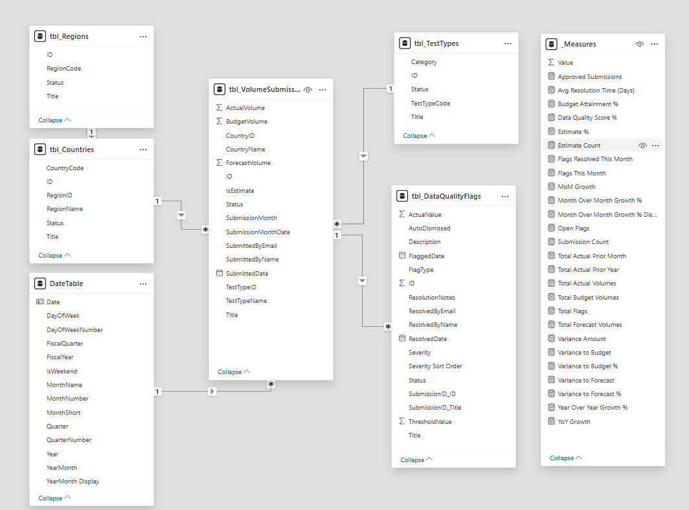

**Key Features:**
- DateTable enables time intelligence (YoY, MoM, fiscal year calculations)
- Normalized structure prevents data redundancy
- One-to-many relationships enforce referential integrity
- tbl_DataQualityFlags added Week 3 for validation tracking
- Scalable design supports future extensions

### Technical Achievements

**Data Modeling:**
- Star schema with proper Many-to-One relationships
- Custom DateTable with fiscal year support (Oct-Sep)
- tbl_DataQualityFlags integration (13 flags, 5 validation types)
- Power Query transformations for all 6 tables

**DAX Measures (25+ total):**
- Volume calculations: Total Actual/Budget/Forecast Volumes
- Time intelligence: YoY Growth %, MoM Growth %, Prior Year comparisons
- Variance analysis: Budget Attainment %, Variance Amount/Percentage
- Data quality: Total Flags, Open Flags, Avg Resolution Time (Days), Data Quality Score %
- Temporal calculations: Flags Resolved This Month, Flags This Month
- Supporting: Approved Submissions, Submission Count, Rankings

**Advanced Techniques:**
- Manual date calculations (YEAR/MONTH/DATE/EOMONTH) for measure compatibility
- Conditional formatting with background colors (4 severity types)
- Edit interactions configuration for context-aware filtering
- Cross-visual filtering and drill-down capabilities
- Hierarchical drill-down (Region → Country)

**Visualizations (30+ across 6 pages):**
- KPI cards (16 total across all pages)
- Column charts (8) with data labels
- Line charts (5) with markers and smooth lines
- Donut charts (2) with percentage labels
- Bar charts (4) with data labels
- Matrix (1) with hierarchical drill-down
- Gauge (1) with performance zones
- Azure Maps (1) with proportional bubbles

### Business Insights Delivered

**Performance Metrics:**
- Overall: 100.3% budget attainment, 7.1% YoY growth
- Geographic: Korea leads with 18K volumes (29% of total)
- Product: Leadership Fundamentals dominates (38% market share)
- Quality: 93.3% quality score, 9 flags requiring attention

**Operational Intelligence:**
- Budget variance issues average 5 days to resolve
- Anomaly detection catching issues proactively
- Late submission tracking shows compliance patterns
- Zero volumes identified for demand analysis

**Portfolio Complete:** 6 pages | 30+ visualizations | 25+ DAX measures | Star schema | Production-ready ✅
---


## 📸 Screenshots

*Screenshots will be added progressively as development proceeds*
### Power Apps 
### Enrollment Submission Portal (Weeks 2-4 - Complete)

**Screen 1: Welcome & User Selection**

*Modern card-based design with user dropdown filtered to active coordinators*

**Screen 2: Submission Form**
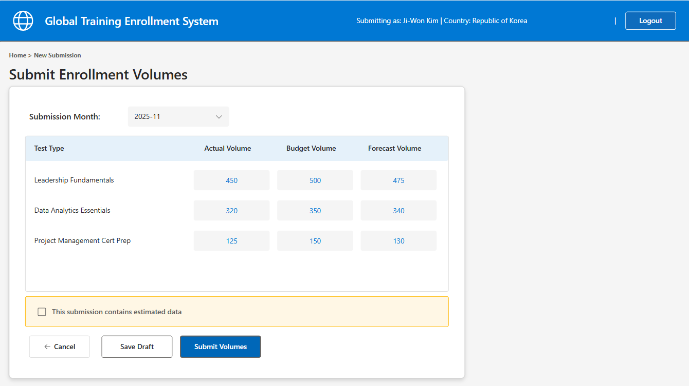
*Dynamic test type loading with three-column volume entry (Actual, Budget, Forecast)*


*Conditional estimate reason field with validation*

**Screen 3: Confirmation**

*Success confirmation with complete submission details and next steps*

**SharePoint Integration**
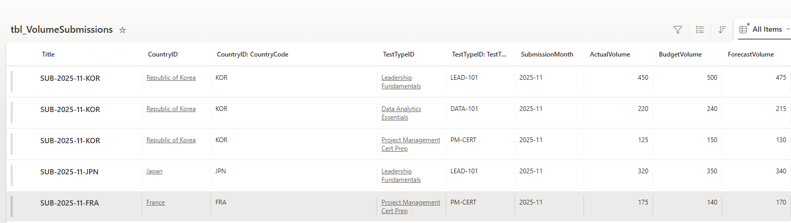
*Volume data properly stored with lookup relationships to Countries and TestTypes*

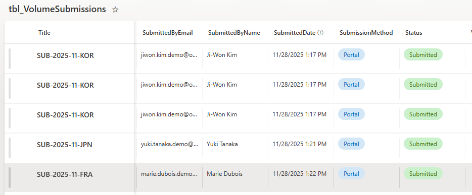
*Successful data writes to tbl_VolumeSubmissions with status tracking and submission metadata*

**Screen 4: Submission History**
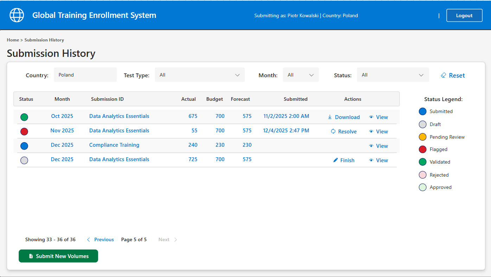
*Full-row clickable pattern with status circles, smart filters, and pagination (showing 1-8 of 23 submissions)*

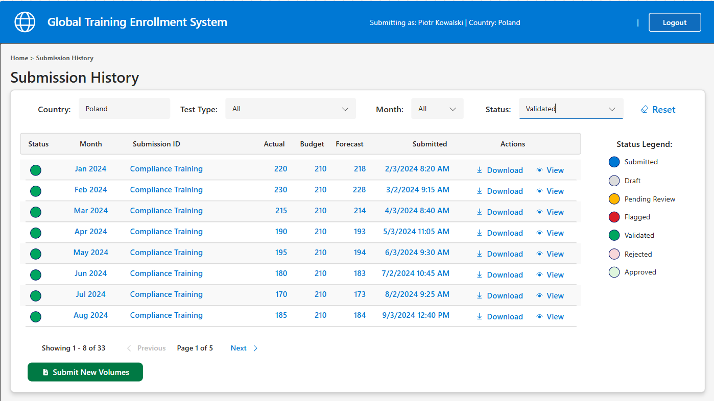
*Filtered view showing only validated submissions with green status indicators*

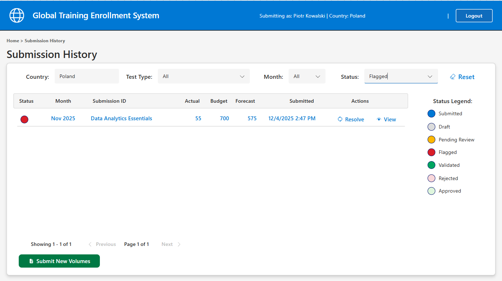
*Flagged submissions with red status circles and contextual Resolve action buttons*

**Screen 5: Submission Detail**
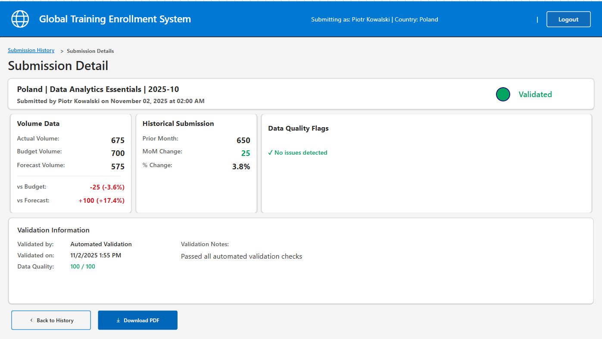
*Validated submission with variance calculations, validation information, and "No quality issues" confirmation*

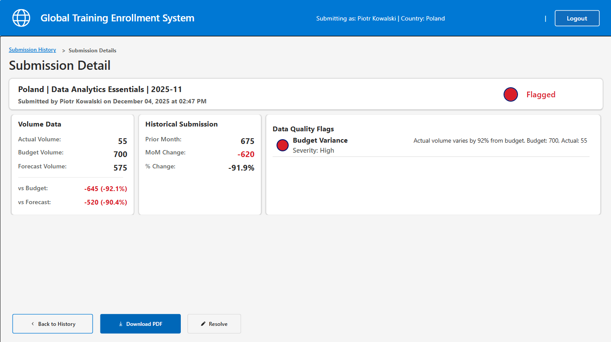
*Flagged submission displaying data quality issues with severity-based color coding and detailed descriptions*

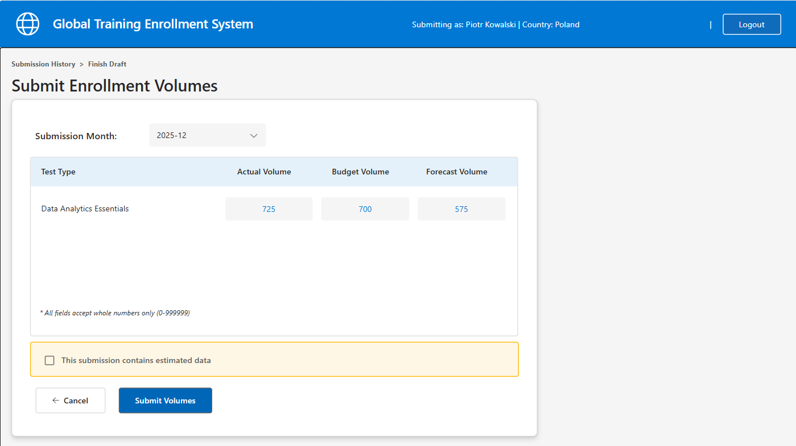
*Inline editing workflow for draft completion - contextual form preserves visibility of submission details*

### Data Quality Dashboard (Week 4 - In Progress)

**Submission Tracking Screen**

**Overview: Full Submission List**
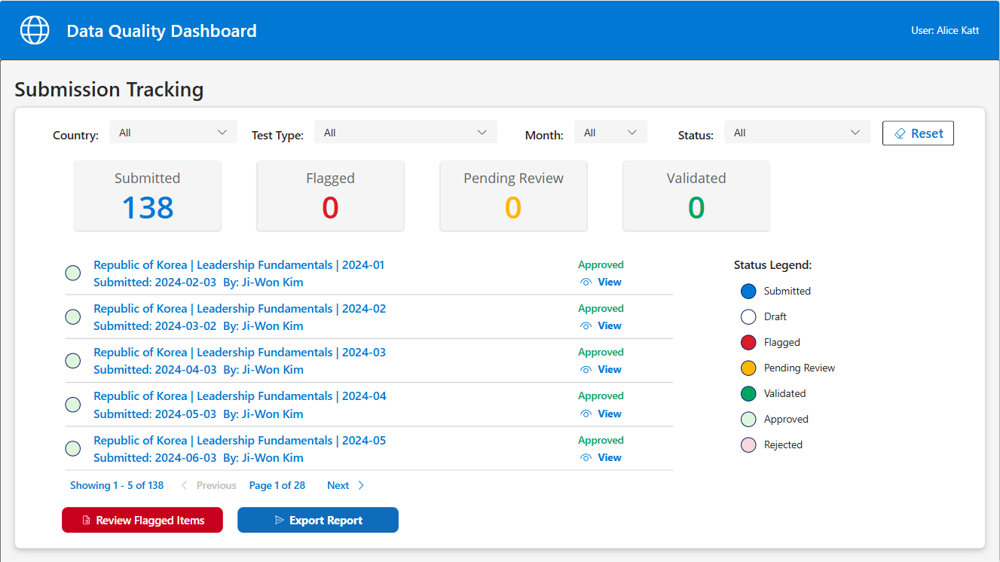
*Complete analyst dashboard with 4 dynamic filters, KPI summary cards (5 Submitted, 1 Flagged, 0 Pending, 132 Approved), professional pagination, and data-driven status legend. Shows 5 items per page with "Page 1 of 28" navigation. Toggle provided to allow users to filter out Approved Items*

**Filtered View: Country Selection**
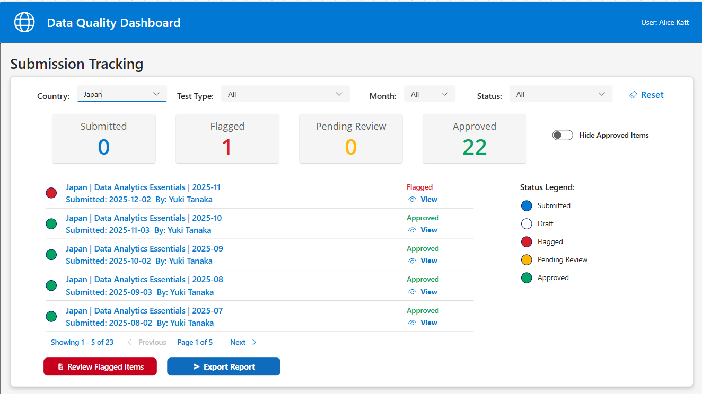
*Dynamic filtering in action - Japan selected showing 1 flagged item and 22 approvals with updated KPI counts and pagination (Page 1 of 5). Demonstrates cascading filter logic with real-time collection updates.*

**Pagination: Edge Case Handling**
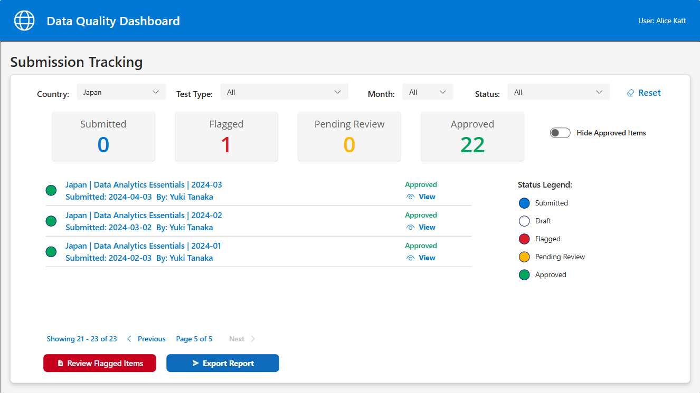
*Last page pagination showing exact remainder calculation (3 items on final page). Custom formula prevents item duplication: LastN(collection, Total - (CompletedPages × ItemsPerPage))*

**Toggle: Hide Approved Items**
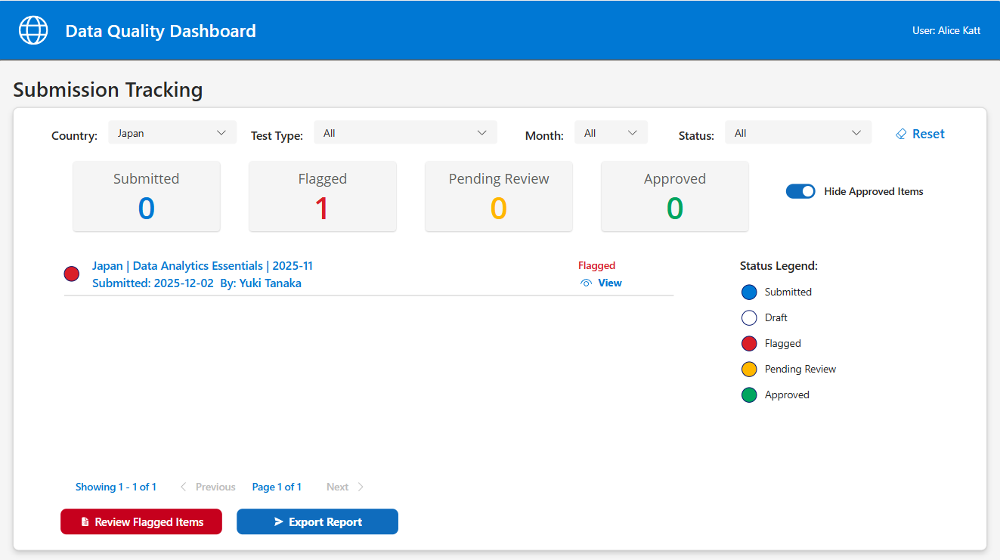
*Complete analyst dashboard with toggle checked to hide Approved items, KPI summary cards (0 Submitted, 1 Flagged, 0 Pending, 0 Approved)*

### Data Quality Dashboard
- Anomaly detection interface
- Validation workflow
- Communication tools

### Administrator Console
- Center management
- Course catalog administration
- User access control
- System monitoring

### Power BI Dashboard

**Six comprehensive pages provide insights for multiple stakeholder groups:**

1. **Executive Summary** - High-level KPIs and performance overview
   
   *Scorecard with 4 KPIs, 11-month trend, Top 5 countries, performance gauge*

2. **Geographic Analysis** - Regional and country-level breakdowns
   
   *Azure Maps with proportional bubbles, hierarchical matrix, regional KPI cards*

3. **Trend Analysis** - Time-based patterns and growth tracking
   
   *24-month combo chart, variance trend with conditional formatting, YoY growth*

4. **Test Type Analysis** - Product portfolio performance
   
   *Side-by-side Actual vs Budget, market share donut, 24-month trend lines*

5. **Data Quality Monitoring** - Executive health check and operational metrics
   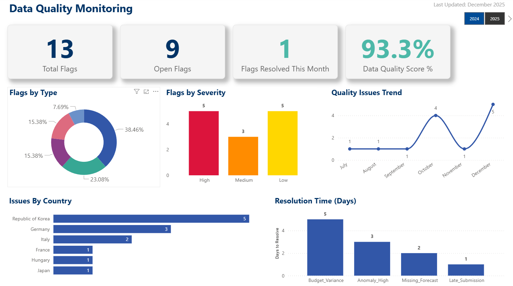
   *Dual-audience design: Executive KPIs + flags analysis + resolution metrics*

6. **Flag Review Workbench** - Analyst operational page
   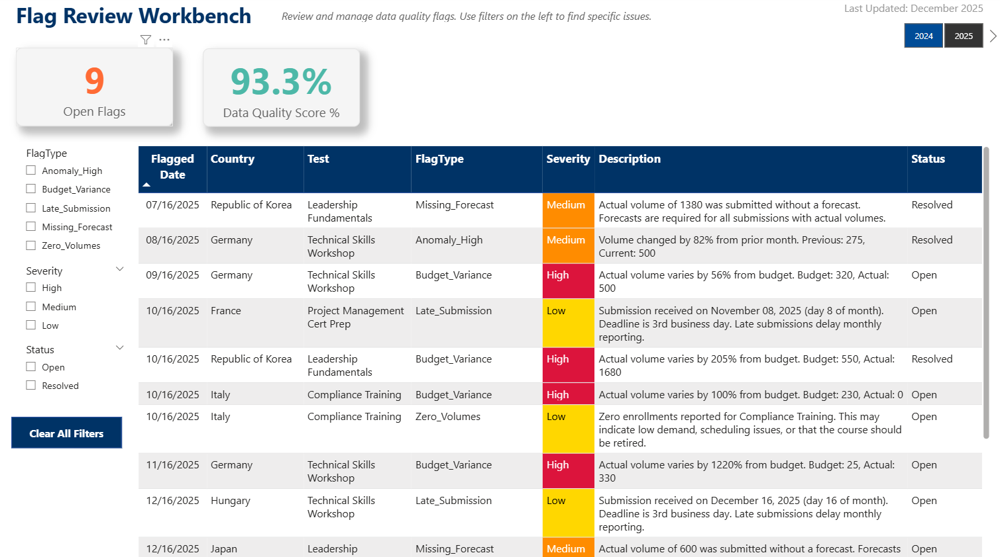
   *Focused workspace with filtering, detailed table, conditional formatting*

**Data Model Architecture:**


*Star schema with VolumeSubmissions fact table, dimension tables (Countries, Regions, TestTypes, DateTable), and DataQualityFlags extension*


### Accessibility Considerations

**WCAG 2.1 Level AA compliance addressed:**
- All interactive controls have descriptive AccessibleLabel properties
- Labels describe both control type and purpose
- Dynamic labels reflect control state (enabled/disabled)
- Screen reader users can navigate the full workflow

**Remaining work (documented for production):**
- Gallery item accessibility (individual row navigation)
- Keyboard shortcuts for common actions
- High contrast theme support
- Focus indicators for keyboard navigation

---

## 📁 Project Structure

```
global-training-enrollment-system/
├── docs/                                                 # Project documentation
│   ├── 01-project-overview.md                            # Business case and objectives
│   ├── 02-requirements.md                                # Functional and technical requirements
│   ├── 03-data-model.md                                  # Entity relationships and schemas
│   ├── 04-user-stories.md                                # Use cases and acceptance criteria
│   └── 05-pain-points-and-lessons-learned.md             # Original problem and design decisions
│   └── 06-future-enhancements.md                         # Parking lot items for future enhancement
├── power-apps/                                           # Canvas app documentation
│   ├── screenshots/01-GTE_SubmissionPortal               # UI screenshots - Submission Portal
│   │   ├── 01-welcome-screen.png                         # Submission portal Welcome Screen
│   │   ├── 02-submission-form.png                        # Submission portal Submission Form
│   │   ├── 02b-submission-form-estimate.png              # Submission portal Submission Form (Estimates)
│   │   ├── 03-confirmation-screen.png                    # Submission portal Confirmation Screen
│   │   ├── 04-sharepoint-data.png                        # SharePoint data updated with Submission data
│   │   ├── 04b-sharepoint-data-status.png                # SharePoint data updated with Submission data
│   │   ├── 05-submission-history-default.png             # Submission history screen - default view (all statuses)
│   │   ├── 06-submission-history-validated.png           # Submission history screen - filtered to validated only
│   │   ├── 07-submission-history-flagged.png             # Submission history screen - flagged items with resolve actions
│   │   ├── 08-submission-detail-validated-clean.png      # Submission detail - validated with no quality issues
│   │   ├── 09-submission-detail-flagged.png              # Submission detail - flagged with quality issues displayed
│   │   ├── 10-submission-detail-edit-draft.png           # Submission detail - inline edit mode for draft completion
│   │   └── 11-submission-detail-edit-resolve.png (TODO)  # Submission detail - inline edit mode for issue resolution
│   ├── screenshots/01-GTE_DataQuality                    # UI screenshots - Submission Portal
│   │   ├── 01-submission-tracking-overview.png           # Submission tracking screen overview
│   │   ├── 02-submission-tracking-filtered.png           # Submission tracking screen filtered view
│   │   ├── 03-submission-tracking-pagination.png         # Submission tracking screen pagination
│   │   ├── 04-submission-tracking-approvals-hidden.png   # Submission tracking screen approvals filteredout
│   ├── wireframes/                                       # UI wireframes
│   │   ├── wireframes-admin_console.pptx                 # Admin Console app
│   │   ├── wireframes-dataquality-portal.pptx            # Data Quality Portal app 
│   │   └── wireframes-submission-portal.pptx             # Submission Portal app  
│   └── app-documentation.md                              # Design decisions and formulas
├── power-automate/                                       # Flow documentation
│   ├── screenshots/                                      # Visual workflow visuals
│   └── flow-documentation.md                             # Flow logic and error handling
├── power-bi/                                             # Dashboard documentation
│   ├── desktop files/                                    # Power BI Desktop Historical versions
│   │   ├── GTE_Dashboard_v1.pbix                         # Executive Summary Screen Complete
│   │   ├── GTE_Dashboard_v2.pbix                         # Geographic Analysis Screen Complete
│   │   ├── GTE_Dashboard_v3.pbix                         # Trend Analysis Screen Complete
│   │   ├── GTE_Dashboard_v4.pbix                         # Test Type Analysis Screen Complete
│   │   ├── GTE_Dashboard_v5_Final.pbix                   # Data Quality Screen, Flag Review Screen and Final Dashboard Complete
│   ├── screenshots/                                      # Dashboard visuals
│   │   ├── 01-executive-summary-final.png                # Executive Summary Screen - KPIs and trend analysis
│   │   ├── 02-geographic-analysis-final.png              # Geographic Analysis Screen - Azure Maps with drill-down
│   │   ├── 03-trend-analysis-final.png                   # Trend Analysis Screen - 24-month view with variance trends
│   │   ├── 04-test-type-analysis-final.png               # Test Type Analysis Screen - Performance and market share
│   │   ├── 05-data-quality-monitoring.png                # Data Quality Monitoring Screen - Flags by type, severity, and country
│   │   ├── 06-flag-review-workbench.png                  # Flag Review Workbench - Analyst workflow with detailed flag table
│   │   ├── 07-data-model-relationships.png               # Data Model Relationships - Star schema with fact and dimension tables
│   └── dashboard-documentation.md                        # Data model and DAX measures
├── sharepoint/                                           # Data layer documentation
│   ├── screenshots/                                      # UI screenshots & wireframes
│   │   ├── tbl_Countries.png                             # Country Listing
│   │   ├── tbl_CountryTestTypes.png                      # Junction Table Country to Test types 
│   │   ├── tbl_VolumeSubmissions                         # Volume Submission Fact table 
│   │   └── tbl_VolumeSubmissions (2)                     # Volume Submission Fact table 
│   └── list-schemas.md                                   # List structures and relationships
└── README.md                                             # This file
```

---

## 🎓 Learning Objectives

This portfolio project demonstrates proficiency in:

### Power Apps Best Practices
- **Component Architecture**: Reusable UI components across multiple apps
- **Performance Optimization**: Delegation-aware formulas for large datasets
- **User Experience Design**: Intuitive interfaces with contextual help
- **Error Handling Patterns**: Graceful failures with clear user guidance
- **Accessibility Standards**: WCAG 2.1 compliance for inclusive design
- **Mobile Responsiveness**: Adaptive layouts for multiple device types
- **State Management**: Efficient use of context variables and collections

### Power Automate Expertise
- **Complex Workflows**: Multi-stage approval and validation processes
- **Email Processing**: Parsing attachments and extracting structured data
- **Error Handling**: Comprehensive try-catch patterns with logging
- **Performance Tuning**: Parallel processing and optimized actions
- **Integration Patterns**: Connecting multiple data sources seamlessly
- **Monitoring and Debugging**: Proactive error detection and resolution

### Power BI Visualization
- **Data Modeling**: Star schema design with optimized relationships
- **DAX Mastery**: Complex measures for business calculations
- **Interactive Design**: Drill-through, bookmarks, and dynamic filtering
- **Time Intelligence**: Year-over-year, quarter-over-quarter comparisons
- **Performance Optimization**: Query folding and aggregation strategies
- **Row-Level Security**: Dynamic filtering based on user context
- **Mobile Design**: Optimized layouts for Power BI mobile app

### Solution Architecture
- **Requirements Analysis**: Translating business problems into technical solutions
- **Data Modeling**: Normalized schema design for scalability
- **Security Design**: Role-based access control across platforms
- **Integration Strategy**: Seamless data flow between Power Platform services
- **Documentation Standards**: Enterprise-grade technical documentation
- **Scalability Planning**: Designing for growth and increased usage
- **Change Management**: Considering user adoption and training needs

---## 🛠️ Development Approach

### Phase 1: Planning & Design (Week 1) ✅ COMPLETE
- ✅ Repository setup and documentation framework
- ✅ Pain points analysis and lessons learned documentation  
- ✅ Detailed requirements gathering (150+ requirements across 9 categories)
- ✅ Data model design with star schema and audit patterns
- ✅ User story creation with acceptance criteria (18 stories mapped to requirements)
- ✅ SharePoint schema design (9 lists, 100+ columns documented)
- ✅ SharePoint lists creation with sample data (138 records across all lists)

### Phase 2: Core Applications (Week 2) ✅ COMPLETE
- ✅ Submission Portal Screens 1-3 (Welcome, Form, Confirmation)
- ✅ Collection-based theme system (colTheme with GetThemeColor() function)
- ✅ User simulation dropdown (single-user tenant workaround)
- ✅ ForAll + Patch pattern for multi-row submissions
- ✅ Choice and lookup column formatting (proper SharePoint syntax)
- ✅ Power Automate confirmation flow (HTML email with submission details)
- ✅ Power Automate analyst alert flow (notification to data quality team)
- ✅ Power Automate data quality monitoring flow (5 validation types, automatic flagging)

### Phase 3: Analytics & Reporting (Week 3) ✅ COMPLETE
- ✅ Power BI data model with star schema (fact + dimension tables)
- ✅ DateTable with fiscal calendar and time intelligence
- ✅ 25+ DAX measures (YoY growth, MoM growth, variance calculations, quality scores)
- ✅ Executive Summary page (KPI cards, trends, top performers)
- ✅ Geographic Analysis page (Azure Maps, drill-down matrix, regional performance)
- ✅ Trend Analysis page (24-month view, variance waterfall, growth indicators)
- ✅ Test Type Analysis page (performance bars, market share, trend lines)
- ✅ Data Quality Monitoring page (flags by type/severity, issues by country, resolution time)
- ✅ Flag Review Workbench page (analyst table with filters, detailed descriptions)

### Phase 4: Submission Management (Week 4) ✅ COMPLETE
- ✅ Submission History screen (status circles, smart filters, pagination, full-row clickable)
- ✅ Submission Detail screen (manual labels, variance calculations, validation info)
- ✅ Data Quality Flags integration (OnVisible load, severity-based icons/colors)
- ✅ Inline editing mode (contextual form for draft completion and flagged resolution)
- ✅ Status-based actions (different buttons per workflow: Finish, View, Download, Resolve)
- ✅ Centralized status management (colStatus collection with GetStatusColor() function)
- ✅ Delegation-friendly data loading (two-step pattern: SharePoint → collection → filter)
- ✅ Edit mode save logic (Patch update preserving audit trail)

### Phase 5: Final Documentation & Testing (Week 5) 🔄 IN PROGRESS
- ✅ Comprehensive screenshot capture (17 Power Apps, 7 Power BI)
- ✅ Screenshot descriptions and portfolio presentation
- ✅ README updates with current progress and version history
- 🔲 Final testing scenarios (flagged item resolution, draft editing)
- 🔲 Formula documentation in app-documentation.md
- 🔲 Architecture decision log updates
- 🔲 Optional: 10-minute video demonstration
- 🔲 LinkedIn post and portfolio materials

## 📝 Documentation Standards

Throughout development, I'm maintaining:

### Design Decisions Log
- Rationale for architectural choices
- Alternatives considered and why they were rejected
- Trade-offs and their implications
- Performance considerations

### Lessons Learned
- Challenges encountered during development
- Solutions implemented and their effectiveness
- What I would do differently next time
- Best practices discovered through implementation

### Technical Specifications
- Detailed formula documentation
- Flow action configurations
- DAX measure definitions
- Security role definitions

### Testing Documentation
- Test scenarios and acceptance criteria
- Bug tracking and resolution
- Performance testing results
- User acceptance testing outcomes

*All documentation is version-controlled in this repository and updated in real-time as the project evolves.*

---

## 💡 Key Design Decisions

### Why Canvas Apps Over Model-Driven?
Canvas apps provide the flexibility needed for the dynamic, form-heavy interfaces required for enrollment submission. The pixel-perfect control allows for optimized mobile experiences for global users.

### Why DirectQuery vs Import in Power BI?
DirectQuery ensures executives always see real-time data without manual refreshes. For this use case, query performance is acceptable given the moderate data volume.

### Design System Implementation (App.Formulas Theme)

**Decision:** Centralized color palette using App.OnStart instead of inline RGBA values.

### Theme System: Why Collection-Based in Solutions?

**Decision:** Theme stored in collection (colTheme) accessed via LookUp, rather than App.Formulas or App.OnStart variables.

**Why:**
Canvas apps within solutions use delayed loading for performance - variables set in App.OnStart don't initialize until first screen renders. Collections are the exception - they load immediately during startup.

**Issue Encountered:**
Published app showed black backgrounds despite Theme object working perfectly in edit mode. App.Formulas and Set() variables were timing out.

**Solution:**
```powerfx
// App.OnStart
ClearCollect(colTheme, 
    {Name: "Primary", Color: RGBA(0,120,212,1)},
    // ... all theme colors
);

// App.Formulas
GetThemeColor(ColorName:Text):Color=LookUp(colTheme, Name = ColorName).Color;

// Usage in controls
Fill = GetThemeColor("Primary")
```

**Benefits:**
- Guaranteed initialization before first screen renders
- Single source of truth for brand colors
- Works reliably in managed solutions and published apps
- Enterprise-grade pattern used in ALM scenarios

**Learning:**
This is a real-world difference between development/edit mode vs published/production apps. Collections behave differently in the app lifecycle - a critical insight for professional Power Apps development.


**Benefits:**
- Single source of truth for brand colors - update once, changes everywhere
- Automatic color variations using ColorFade() for consistency
- Semantic naming improves code readability
- Enables rapid theme updates without touching individual controls
- Production-ready approach used by enterprise teams

**Why Not Inline Styling:**
Inline RGBA values (e.g., `Fill = RGBA(0,120,212,1)`) create maintenance nightmares when:
- Brand colors change (update 50+ controls manually)
- Inconsistencies creep in (slightly different blues across screens)
- New developers don't know which color to use

### Why SharePoint Lists vs Dataverse?
SharePoint provides sufficient relational capabilities for this scenario while being included in most M365 licenses, reducing deployment friction. Lists also integrate seamlessly with existing document libraries.

### Why Multiple Apps vs Single App with Screens?
Separate apps allow for distinct security contexts (external vs internal) and independent update cycles. This also improves performance by loading only necessary components.

### Why ForAll + Patch Instead of Bulk Operations?

Power Apps doesn't support true bulk insert operations. The ForAll/Patch pattern is the recommended approach for multi-row operations. Key learnings:

- **Lookup column format:** SharePoint requires `{Id: X, Value: "Y"}` format for lookups with additional columns shown
- **Choice column format:** Choice fields require `{Value: "X"}` record format, not plain strings
- **Collection strategy:** Build collection first, then iterate with ForAll for cleaner error handling
- **Debugging technique:** Used Power Automate flow to inspect actual SharePoint schema when formulas failed

This pattern successfully writes 3-15 records per submission (one per test type) with full audit trail.

### Why Conditional "Actual" vs "Estimate" Labeling?

When users check the "IsEstimate" checkbox, the confirmation screen dynamically changes the label from "Actual: 500" to "Estimate: 500" in the test type summary. This:

- Provides immediate visual confirmation that estimate flag was applied
- Reduces user anxiety about whether checkbox was properly submitted
- Aligns confirmation display with actual data state in SharePoint
- Demonstrates attention to UX detail and data accuracy

Implemented via `varActualType` context variable set during submission, consumed in confirmation gallery template.

*Detailed rationale for all architectural decisions documented in `/docs/05-pain-points-and-lessons-learned.md`*

### Email Notification Strategy

**Decision:** Automated email notifications via Power Automate for submission confirmation and analyst alerts.

**Implementation:**
Two event-driven flows trigger on SharePoint list item changes:

1. **Submission Confirmation Flow**
   - Trigger: Item created/modified in tbl_VolumeSubmissions
   - Condition: Status = "Submitted"
   - Action: Send HTML email to coordinator with submission details
   - Includes: Submission ID, country, month, date, next steps

2. **Analyst Alert Flow**
   - Trigger: Same as above
   - Action: Alert data quality analyst (Alice Katt) of new submission
   - Includes: Submission details plus IsEstimate flag for prioritization

**Technical Details:**
- SharePoint trigger: "When an item is created or modified"
- Conditional logic filters to Status = "Submitted" only
- Get item action retrieves country name via lookup
- DateTime formatting via formatDateTime() expression
- HTML email templates with inline CSS for consistent branding

**Why Automated Notifications:**
- Reduces coordinator anxiety (immediate confirmation)
- Enables proactive analyst workflow (no manual checking)
- Provides audit trail (email receipts)
- Supports async work (coordinators can submit anytime)
- Scalable pattern (add more recipients/conditions easily)

**Time Investment:**
Two flows built and tested in ~3 hours, demonstrating Power Automate proficiency alongside Power Apps development.

---

## 🤝 Contributing

This is a portfolio project demonstrating Power Platform capabilities. While it's not intended for production use, I welcome:

- Feedback on design decisions and architecture
- Suggestions for alternative approaches
- Questions about implementation details
- Ideas for extending functionality

Feel free to open an issue or reach out directly.

---

## 📧 Contact

John Rolzhausen 
LinkedIn Profile: https://www.linkedin.com/in/john-rolzhausen-195989217/
Email: john.rolzhausen@live.com  


---

## 📄 License

This project is licensed under the MIT License - see the [LICENSE](LICENSE) file for details.

---

## 🙏 Acknowledgments

- Inspired by 20 years of experience in educational services
- Built to solve real-world data collection challenges I encountered
- Developed using Power Platform best practices and modern architecture patterns
- Created as a demonstration of continuous learning and professional growth

---

## 🔄 Project Evolution

### Version History
- **v0.1.0** (November 19, 2025) - Initial repository setup and documentation framework
- **v0.2.0** (November 22, 2025) - Requirements and design phase complete
- **v0.3.0** (November 27, 2025) - Submission Portal and automation flows complete
- **v0.3.5** (November 30, 2025) - Submission History screen shell added
- **v0.4.0** (December 1, 2025) - Power BI data foundation complete (Day 1 of Week 3)
- **v0.5.0** (December 3, 2025) - Power BI dashboard complete
- **v0.6.0** (December 17, 2025) - Power BI dashboard complete with 6 pages including Data Quality Monitoring and Flag Review Workbench
- **v0.7.0** (December 21, 2025) - Submission Management screens (4-5) complete with inline editing, variance calculations, flag display
- **v0.8.0** (December 29, 2025) - Comprehensive documentation and screenshots complete (17 Power Apps, 7 Power BI)
- **v1.0.0** (Target: January 5, 2026) - Final testing and portfolio presentation materials

### What's Different from the Original System
This redesign addresses the specific failures of the previous implementation:

**Original Problem**: Email-based Excel submissions with inconsistent formats
**Solution**: Standardized portal with validation OR intelligent email processing with error handling

**Original Problem**: Manual data cleanup taking hours monthly
**Solution**: Automated validation with systematic review workflow

**Original Problem**: Breaking when centers changed formats
**Solution**: Flexible schema detection and graceful degradation

**Original Problem**: No visibility into submission status
**Solution**: Real-time dashboard with completion tracking

**Original Problem**: Day-old data in reports
**Solution**: Live DirectQuery connection to SharePoint

**Original Problem**: No way to identify anomalies quickly
**Solution**: Automated anomaly detection with configurable thresholds

---

**Project Status**: ✅ Week 4 Complete - Comprehensive Portfolio Project with Full Documentation  
**Current Phase**: Phase 5 - Final Testing & Presentation Materials  
**Completion**: 90% Complete (4.5 of 6 weeks)  
**Last Updated**: December 29, 2025  
**Days Completed**: 18 of 30  
**Target Completion**: January 9, 2026
